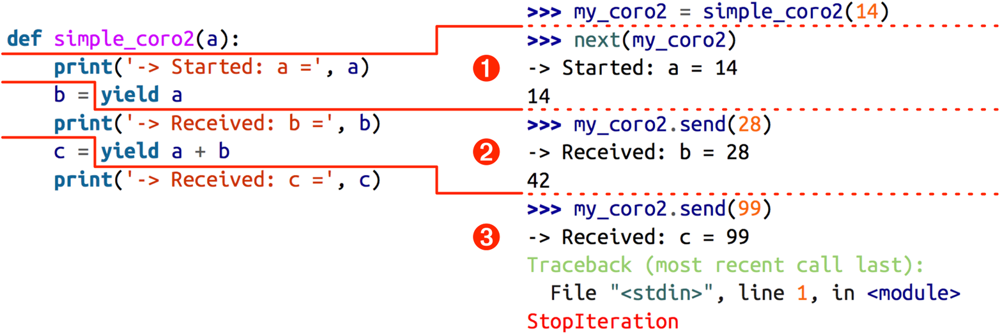
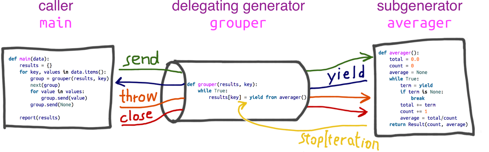
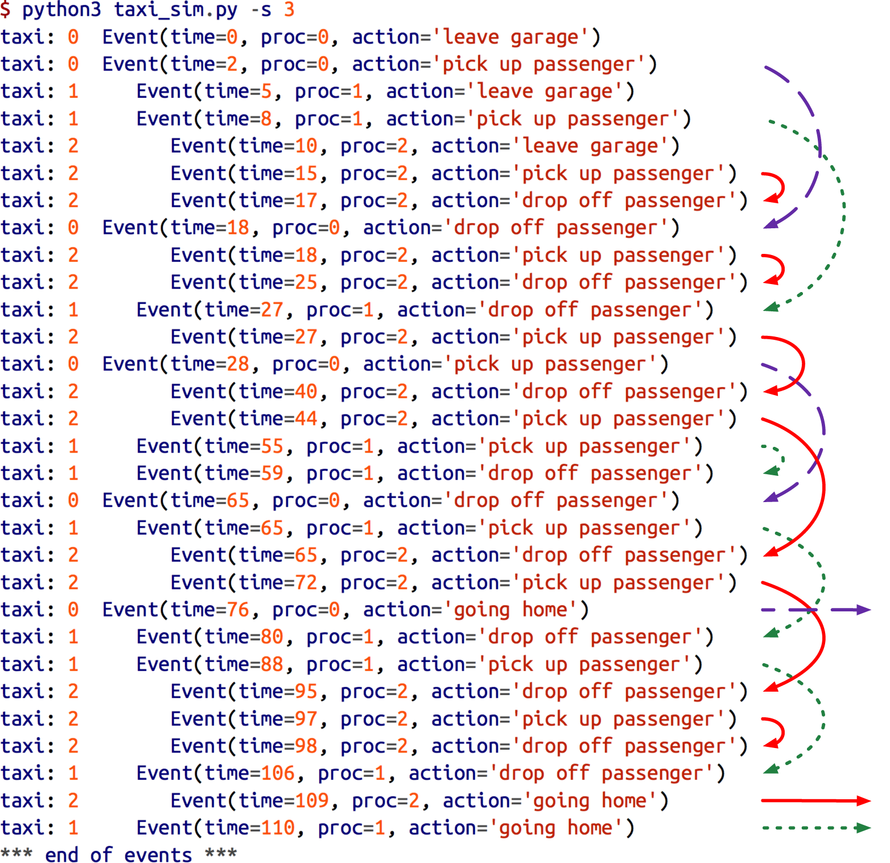

[[intro]]
== Coroutine Flavors

[quote, A. Jesse Jiryu Davis and Guido van Rossum, A Web Crawler With asyncio Coroutines]
____
There are many implementations of coroutines; even in Python there are several. […] Starting in Python 3.5, coroutines are a native feature of the language itself; however, understanding coroutines as they were first implemented in Python 3.4, using pre-existing language facilities, is the foundation to tackle Python 3.5's native coroutines.footnote:[_500 Lines or Less_, edited by Michael DiBernardo, chapter http://aosabook.org/en/500L/a-web-crawler-with-asyncio-coroutines.html#coroutines[A Web Crawler With asyncio Coroutines] by A. Jesse Jiryu Davis and Guido van Rossum.]
____

We find two main senses for the verb "to yield" in dictionaries: to produce or to give way. Both senses apply in Python when we use the `yield` keyword in a generator. A line such as `yield item` produces a value that is received by the caller of `next(…)`, and it also gives way, suspending the execution of the generator so that the caller may proceed until it's ready to consume another value by invoking `next()` again. The caller pulls values from the generator.

A Python coroutine is essentially a generator driven by calls to its `.send(…)` method.
In a coroutine, the essential meaning of "to yield" is to give way—to hand control to some other part of the program, and wait until notified to resume.
The caller invokes `my_coroutine.send(datum)` to push data into the coroutine.
The coroutine then resumes and gets `datum` as the value of the `yield` expression where it was suspended.
In normal usage, a caller repeatedly pushes data into the coroutine in that way.
In contrast with generators, coroutines are usually data consumers, not producers.

Regardless of the flow of data, `yield` is a control flow device that can be used to implement cooperative multitasking:
each coroutine yields control to a central scheduler so that other coroutines can be activated.

Since version 3.5, Python has three kinds of coroutines:

classic coroutines::
    A generator function that consumes data sent to it via `my_coro.send(data)` calls, and reads that data by using `yield` in an expression.
    Classic coroutines can delegate to other classic coroutines using `yield from`.

generator-based coroutines::
    A generator function decorated with `@types.coroutine`, which makes it compatible with the new `await` keyword, introduced in Python 3.5.

native coroutines::
    A coroutine defined with `async def`. You can delegate from a native coroutine to another native coroutine or to a generator-based coroutine using the `await` keyword, similar to how classic coroutines use `yield from`.

Native coroutines and generator-based coroutines are intended specifically for asynchronous I/O programming. As such, we'll get back to them in <<async_ch>>—Basic Asyncio.

This chapter is about _classic coroutines_.
Although native coroutines evolved from classic coroutines, they don't replace them completely.
Classic coroutines have some useful behaviors that native coroutines can't emulate—and vice-versa,
native coroutines have features that are missing in classic coroutines.

Classic coroutines are the product of a series of enhancements to the simpler generator functions we've seen so far in the book.
Following the evolution of coroutines in Python helps understand their features in stages of increasing functionality and complexity.

After a brief overview of how generators were enhanced to act as coroutines, we jump to the core of the chapter. Then we'll see:

* The behavior and states of a generator operating as a coroutine.
* Priming a coroutine automatically with a decorator.
* How the caller can control a coroutine through the `.close()` and `.throw(…)` methods of the generator object.
* How coroutines can return values upon termination.
* Usage and semantics of the new `yield from` syntax.
* A use case: coroutines for managing concurrent activities in a simulation.

[NOTE]
====
In this chapter I often use the word "coroutine" to refer to classic coroutines—a.k.a. generator-based coroutines—
except when I am contrasting them with native coroutines.
====

=== What's new in this chapter

Since 2012 when `yield from` was implemented in Python 3.3,
classic coroutines did not undergo major changes. Native coroutines—created with `async def`—are similar,
but not a full replacement of classic coroutines. They are covered in <<async_ch>>.

Therefore, this chapter has no significant changes except for the occasional comparisons of
classic versus native coroutines, as well as `yield from` versus `await`.

=== How Coroutines Evolved from Generators

A classic coroutine is syntactically like a generator: just a function with the `yield` keyword in its body.
However, in a coroutine, `yield` usually appears on the right-hand side of an expression (e.g., `datum = yield`),
and it may or may not produce a value--if there is no expression after the `yield` keyword,
the generator yields `None`.
The coroutine may receive data from the caller, which uses `coro.send(datum)` instead of `next(coro)` to drive the coroutine.
Usually, the caller pushes values into the coroutine.
It is even possible that no data goes in or out through the `yield` keyword.
When you start thinking of `yield` primarily in terms of control flow, you have the mindset to understand why coroutines are useful for concurrent programming.

The infrastructure for coroutines appeared in https://www.python.org/dev/peps/pep-0342/[PEP 342 -- Coroutines via Enhanced Generators],
implemented in Python 2.5 (2006): since then, the `yield` keyword can be used in an expression, and the `.send(value)` method was added to the generator API.
This allows a generator to be used as a coroutine: a procedure that collaborates with the caller, yielding and receiving values from the caller.

In addition to `.send(…)`, PEP 342 also added `.throw(…)` and `.close()` methods that respectively allow the caller to throw an exception to be handled inside the generator, and to terminate it. These features are covered in the next section and in <<coro_termination_sec>>.

The latest evolutionary step for classic coroutines came with https://www.python.org/dev/peps/pep-0380/[PEP 380 - Syntax for Delegating to a Subgenerator], implemented in Python 3.3 (2012).
PEP 380 made two syntax changes to generator functions, to make them more useful as coroutines:

* A generator can now `return` a value; previously, providing a value to the `return` statement inside a generator raised a `SyntaxError`.

* The `yield from` syntax enables complex generators to be refactored into smaller, nested generators while avoiding a lot of boilerplate code previously required for a generator to delegate to subgenerators.

These changes will be addressed in <<coro_return_sec>> and <<coro_yield_from_sec>>.

After PEP 380 there have been no major changes to classic coroutines. PEP 492 introduced native coroutines, but that's a story for <<async_ch>>.

Let's follow the established tradition of _Fluent Python_ and start with some very basic facts and examples, then move into increasingly mind-bending features.

[[coro_basic_sec]]
=== Basic Behavior of a Generator Used as a Coroutine

<<simplest_coro_demo>> illustrates the behavior of a coroutine.

[[simplest_coro_demo]]
.Simplest possible demonstration of coroutine in action
====
[source, pycon]
----
>>> def simple_coroutine():  # <1>
...     print('-> coroutine started')
...     x = yield  # <2>
...     print('-> coroutine received:', x)
...
>>> my_coro = simple_coroutine()
>>> my_coro  # <3>
<generator object simple_coroutine at 0x100c2be10>
>>> next(my_coro)  # <4>
-> coroutine started
>>> my_coro.send(42)  # <5>
-> coroutine received: 42
Traceback (most recent call last):  # <6>
  ...
StopIteration
----
====
<1> A coroutine is defined as a generator function: with `yield` in its body.
<2> `yield` is used in an expression; when the coroutine is designed just to receive data from the client it yields ++None++—this is implicit because there is no expression to the right of the `yield` keyword.
<3> As usual with generators, you call the function to get a generator object back.
<4> The first call is `next(…)` because the generator hasn't started so it's not waiting in a `yield` and we can't send it any data initially.
<5> This call makes the `yield` in the coroutine body evaluate to `42`; now the coroutine resumes and runs until the next `yield` or termination.
<6> In this case, control flows off the end of the coroutine body, which prompts the generator machinery to raise `StopIteration`, as usual.

A coroutine can be in one of four states. You can determine the current state using the `inspect.getgeneratorstate(…)` function, which returns one of these strings:

`'GEN_CREATED'`:: Waiting to start execution.
`'GEN_RUNNING'`:: Currently being executed by the interpreter.footnote:[You'll only see this state in a multithreaded application--or if the generator object calls `getgeneratorstate` on itself, which is not useful.]
`'GEN_SUSPENDED'`:: Currently suspended at a `yield` expression.
`'GEN_CLOSED'`:: Execution has completed.

Because the argument to the `send` method will become the value of the pending `yield` expression, it follows that you can only make a call like `my_coro.send(42)` if the coroutine is currently suspended. But that's not the case if the coroutine has never been activated--when its state is `'GEN_CREATED'`. That's why the first activation of a coroutine is always done with ++next(my_coro)++—you can also call `my_coro.send(None)`, and the effect is the same.

If you create a coroutine object and immediately try to send it a value that is not `None`, this is what happens:

[source, pycon]
----
>>> my_coro = simple_coroutine()
>>> my_coro.send(1729)
Traceback (most recent call last):
  File "<stdin>", line 1, in <module>
TypeError: can't send non-None value to a just-started generator
----

Note the error message: it's quite clear.

The initial call `next(my_coro)` is often described as "priming" the coroutine (i.e., advancing it to the first `yield` to make it ready for use as a live coroutine).

To get a better feel for the behavior of a coroutine, an example that yields more than once is useful. See <<simple_coro2_demo>>.

[[simple_coro2_demo]]
.A coroutine that yields twice
====
[source, pycon]
----
>>> def simple_coro2(a):
...     print('-> Started: a =', a)
...     b = yield a
...     print('-> Received: b =', b)
...     c = yield a + b
...     print('-> Received: c =', c)
...
>>> my_coro2 = simple_coro2(14)
>>> from inspect import getgeneratorstate
>>> getgeneratorstate(my_coro2)  <1>
'GEN_CREATED'
>>> next(my_coro2)  <2>
-> Started: a = 14
14
>>> getgeneratorstate(my_coro2)  <3>
'GEN_SUSPENDED'
>>> my_coro2.send(28)  <4>
-> Received: b = 28
42
>>> my_coro2.send(99)  <5>
-> Received: c = 99
Traceback (most recent call last):
  File "<stdin>", line 1, in <module>
StopIteration
>>> getgeneratorstate(my_coro2)  <6>
'GEN_CLOSED'
----
====
<1> `inspect.getgeneratorstate` reports `GEN_CREATED` (i.e., the coroutine has not started).
<2> Advance coroutine to first `yield`, printing `-> Started: a = 14` message then yielding value of `a` and suspending to wait for value to be assigned to `b`.
<3> `getgeneratorstate` reports `GEN_SUSPENDED` (i.e., the coroutine is paused at a `yield` expression).
<4> Send number `28` to suspended coroutine; the `yield` expression evaluates to `28` and that number is bound to `b`. The `-> Received: b = 28` message is displayed, the value of `a + b` is yielded (`42`), and the coroutine is suspended waiting for the value to be assigned to `c`.
<5> Send number `99` to suspended coroutine; the `yield` expression evaluates to `99` the number is bound to `c`. The `-> Received: c = 99` message is displayed, then the coroutine terminates, causing the generator object to raise `StopIteration`.
<6> `getgeneratorstate` reports `GEN_CLOSED` (i.e., the coroutine execution has completed).

It's crucial to understand that the execution of the coroutine is suspended exactly at the `yield` keyword. As mentioned before, in an assignment statement, the code to the right of the `=` is evaluated before the actual assignment happens. This means that in a line like `b = yield a`, the value of `b` will only be set when the coroutine is activated later by the client code. It takes some effort to get used to this fact, but understanding it is essential to make sense of the use of `yield` in asynchronous programming, as we'll see later.

Execution of the `simple_coro2` coroutine can be split in three phases, as shown in <<simple_coro2_fig>>:

. `next(my_coro2)` prints first message and runs to yield +a+, yielding number +14+.
. `my_coro2.send(28)` assigns +28+ to +b+, prints second message, and runs to `yield a + b`, yielding number +42+.
. `my_coro2.send(99)` assigns +99+ to +c+, prints third message, and the coroutine terminates.

[[simple_coro2_fig]]
.Three phases in the execution of the simple_coro2 coroutine (note that each phase ends in a yield expression, and the next phase starts in the very same line, when the value of the yield expression is assigned to a variable)

Now let's consider a slightly more involved coroutine example.

=== Example: Coroutine to Compute a Running Average

While discussing closures in <<closures_and_decorators>>, we studied objects to compute a running average: <<ex_average_oo>> shows a plain class and <<ex_average_fixed>> presents a higher-order function producing a closure to keep the `total` and `count` variables across invocations. <<ex_coroaverager>> shows how to do the same with a coroutine.footnote:[This example is inspired by a snippet from Jacob Holm in the Python-ideas list, message titled http://bit.ly/1MMc9zy["Yield-From: Finalization guarantees."] Some variations appear later in the thread, and Holm further explains his thinking in http://bit.ly/1MMcano[message 003912].]

[[ex_coroaverager]]
.coroaverager0.py: code for a running average coroutine
====
[source, py]
----
include::./content/extra/classic-coroutines/coroaverager0.py[tags=CORO_AVERAGER]
----
====
<1> This infinite loop means this coroutine will keep on accepting values and producing results as long as the caller sends them. This coroutine will only terminate when the caller calls `.close()` on it, or when it's garbage collected because there are no more references to it.
<2> The `yield` statement here suspends the coroutine, produces a result to the caller, and—later—gets a value sent by the caller to the coroutine, which resumes its infinite loop.

The advantage of using a coroutine is that `total` and `count` can be simple local variables: no instance attributes or closures are needed to keep the context between calls. <<ex_coroaverager_test>> are doctests to show the `averager` coroutine in operation.

[[ex_coroaverager_test]]
.coroaverager0.py: doctest for the running average coroutine in <<ex_coroaverager>>
====
[source, py]
----
include::./content/extra/classic-coroutines/coroaverager0.py[tags=CORO_AVERAGER_TEST]
----
====
<1> Create the coroutine object.
<2> Prime it by calling `next`.
<3> Now we are in business: each call to `.send(…)` yields the current average.

In the doctest (<<ex_coroaverager_test>>), the call `next(coro_avg)` makes the coroutine advance to the `yield`, yielding the initial value for +average+, which is `None`, so it does not appear on the console. At this point, the coroutine is suspended at the `yield`, waiting for a value to be sent. The line `coro_avg.send(10)` provides that value, causing the coroutine to activate, assigning it to `term`, updating the `total`, `count`, and `average` variables, and then starting another iteration in the `while` loop, which yields the `average` and waits for another term.

The attentive reader may be anxious to know how the execution of an `averager` instance (e.g., `coro_avg`) may be terminated, because its body is an infinite loop. We'll cover that in <<coro_termination_sec>>.

But before discussing coroutine termination, let's talk about getting them started. Priming a coroutine before use is a necessary but easy-to-forget chore. To avoid it, a special decorator can be applied to the coroutine. One such decorator is presented next.

[[priming_decorator_sec]]
=== Decorators for Coroutine Priming

You can't do much with a coroutine without priming it: we must always remember to call `next(my_coro)` before `my_coro.send(x)`. To make coroutine usage more convenient, a priming decorator is sometimes used. The `coroutine` decorator in <<ex_corodeco>> is an example.footnote:[There are several similar decorators published on the Web. This one is adapted from the ActiveState recipe http://bit.ly/1MMcuCx[Pipeline made of coroutines] by Chaobin Tang, who in turn credits David Beazley.]

[[ex_corodeco]]
.coroutil.py: decorator for priming coroutine
====
[source, py]
----
include::./content/extra/classic-coroutines/coroutil.py[tags=CORO_DECO]
----
====
<1> The decorated generator function is replaced by this `primer` function which, when invoked, returns the primed generator.
<2> Call the decorated function to get a generator object.
<3> Prime the generator.
<4> Return it.

<<ex_corodeco_use>> shows the `@coroutine` decorator in use. Contrast with <<ex_coroaverager>>.

[[ex_corodeco_use]]
.coroaverager1.py: doctest and code for a running average coroutine using the @coroutine decorator from <<ex_corodeco>>
====
[source, py]
----
include::./content/extra/classic-coroutines/coroaverager1.py[tags=DECORATED_AVERAGER]
----
====
<1> Call `averager()`, creating a generator object that is primed inside the `primer` function of the `coroutine` decorator.
<2> `getgeneratorstate` reports `GEN_SUSPENDED`, meaning that the coroutine is ready to receive a value.
<3> You can immediately start sending values to `coro_avg`: that's the point of the decorator.
<4> Import the `coroutine` decorator.
<5> Apply it to the `averager` function.
<6> The body of the function is exactly the same as <<ex_coroaverager>>.

Several frameworks provide special decorators designed to work with coroutines. Not all of them actually prime the coroutine--some provide other services, such as hooking it to an event loop. One example from the Tornado asynchronous networking library is the http://bit.ly/1MMcGBF[`tornado.gen`] decorator.

The `yield from` syntax we'll see in <<coro_yield_from_sec>> automatically primes the coroutine called by it, making it incompatible with decorators such as `@coroutine` from <<ex_corodeco>>. The `asyncio.coroutine` decorator from the Python 3.4 standard library is designed to work with `yield from` so it does not prime the coroutine. We'll cover it in <<async_ch>>.

We'll now focus on essential features of coroutines: the methods used to terminate and throw exceptions into them.

[[coro_termination_sec]]
=== Coroutine Termination and Exception Handling

An unhandled exception within a coroutine propagates to the caller of the `next` or `send` that triggered it. <<demo_coro_unhandled_exc>> is an example using the decorated `averager` coroutine from <<ex_corodeco_use>>.

[[demo_coro_unhandled_exc]]
.How an unhandled exception kills a coroutine
====
[source, pycon]
----
>>> from coroaverager1 import averager
>>> coro_avg = averager()
>>> coro_avg.send(40)  # <1>
40.0
>>> coro_avg.send(50)
45.0
>>> coro_avg.send('spam')  # <2>
Traceback (most recent call last):
  ...
TypeError: unsupported operand type(s) for +=: 'float' and 'str'
>>> coro_avg.send(60)  # <3>
Traceback (most recent call last):
  File "<stdin>", line 1, in <module>
StopIteration
----
====
<1> Using the `@coroutine` decorated `averager` we can immediately start sending values.
<2> Sending a nonnumeric value causes an exception inside the coroutine.
<3> Because the exception was not handled in the coroutine, it terminated. Any attempt to reactivate it will raise `StopIteration`.

The cause of the error was the sending of a value `'spam'` that could not be added to the `total` variable in the coroutine.

<<demo_coro_unhandled_exc>> suggests one way of terminating coroutines: you can use `send` with some sentinel value that tells the coroutine to exit. Constant built-in singletons like `None` and `Ellipsis` are convenient sentinel values. `Ellipsis` has the advantage of being quite unusual in data streams. Another sentinel value I've seen used is ++StopIteration++—the class itself, not an instance of it (and not raising it). In other words, using it like: `my_coro.send(StopIteration)`.

Since Python 2.5, generator objects have two methods that allow the client to explicitly send exceptions into the coroutine—`throw` and `close`:

`generator.throw(exc_type[, exc_value[, traceback]])`:: Causes the `yield` expression where the generator was paused to raise the exception given. If the exception is handled by the generator, flow advances to the next `yield`, and the value yielded becomes the value of the `generator.throw` call. If the exception is not handled by the generator, it propagates to the context of the caller.

`generator.close()`:: Causes the `yield` expression where the generator was paused to raise a `GeneratorExit` exception. No error is reported to the caller if the generator does not handle that exception or raises ++StopIteration++—usually by running to completion. When receiving a `GeneratorExit`, the generator must not yield a value, otherwise a `RuntimeError` is raised. If any other exception is raised by the generator, it propagates to the caller.

[TIP]
====
The official documentation of the generator object methods is buried deep in _The Python Language Reference_, (see https://docs.python.org/3/reference/expressions.html#generator-iterator-methods[Generator-iterator methods]).
====

Let's see how `close` and `throw` control a coroutine. <<ex_coro_exception>> lists the `demo_exc_handling` function used in the following examples.

[[ex_coro_exception]]
.coro_exc_demo.py: test code for studying exception handling in a coroutine
====
[source, py]
----
include::./content/extra/classic-coroutines/coro_exc_demo.py[tags=EX_CORO_EXC]
----
====
<1> Special handling for `DemoException`.
<2> If no exception, display received value.
<3> This line will never be executed.

The last line in <<ex_coro_exception>> is unreachable because the infinite loop can only be aborted with an unhandled exception, and that terminates the coroutine immediately.

Normal operation of `demo_exc_handling` is shown in <<demo_exc_handling_demo1>>.

[[demo_exc_handling_demo1]]
.Activating and closing demo_exc_handling without an exception
====
[source, py]
----
include::./content/extra/classic-coroutines/coro_exc_demo.py[tags=DEMO_CORO_EXC_1]
----
====

If the `DemoException` is thrown into the coroutine, it's handled and the `demo_exc_handling` coroutine continues, as in <<demo_exc_handling_demo2>>.

[[demo_exc_handling_demo2]]
.Throwing DemoException into demo_exc_handling does not break it
====
[source, py]
----
include::./content/extra/classic-coroutines/coro_exc_demo.py[tags=DEMO_CORO_EXC_2]
----
====

On the other hand, if an unhandled exception is thrown into the coroutine, it stops--its state becomes `'GEN_CLOSED'`. <<demo_exc_handling_demo3>> demonstrates it.

[[demo_exc_handling_demo3]]
.Coroutine terminates if it can't handle an exception thrown into it
====
[source, py]
----
include::./content/extra/classic-coroutines/coro_exc_demo.py[tags=DEMO_CORO_EXC_3]
----
====

If it's necessary that some cleanup code is run no matter how the coroutine ends, you need to wrap the relevant part of the coroutine body in a `try/finally` block, as in <<demo_finally_demo>>.

[[demo_finally_demo]]
.coro_finally_demo.py: use of try/finally to perform actions on coroutine termination
====
[source, py]
----
include::./content/extra/classic-coroutines/coro_finally_demo.py[tags=EX_CORO_FINALLY]
----
====

One of the main reasons why the `yield from` construct was added to Python 3.3 has to do with throwing exceptions into nested coroutines. The other reason was to enable coroutines to return values more conveniently. Read on to see how.

[[coro_return_sec]]
=== Returning a Value from a Coroutine

<<ex_coroaverager2_return>> shows a variation of the `averager` coroutine that returns a result. For didactic reasons, it does not yield the running average with each activation. This is to emphasize that some coroutines do not yield anything interesting, but are designed to return a value at the end, often the result of some accumulation.

The result returned by `averager` in <<ex_coroaverager2_return>> is a `namedtuple` with the number of terms averaged (`count`) and the `average`. I could have returned just the `average` value, but returning a tuple exposes another interesting piece of data that was accumulated: the `count` of terms.

[[ex_coroaverager2_return]]
.coroaverager2.py: code for an averager coroutine that returns a result
====
[source, py]
----
include::./content/extra/classic-coroutines/coroaverager2.py[tags=RETURNING_AVERAGER]
----
====
<1> In order to return a value, a coroutine must terminate normally; this is why this version of `averager` has a condition to break out of its accumulating loop.
<2> Return a `namedtuple` with the `count` and `average`. Before Python 3.3, it was a syntax error to return a value in a generator function.

To see how this new `averager` works, we can drive it from the console, as in <<ex_coroaverager2_demo1>>.

[[ex_coroaverager2_demo1]]
.coroaverager2.py: doctest showing the behavior of averager
====
[source, py]
----
include::./content/extra/classic-coroutines/coroaverager2.py[tags=RETURNING_AVERAGER_DEMO1]
----
====
<1> This version does not yield values.
<2> Sending `None` terminates the loop, causing the coroutine to end by returning the result. As usual, the generator object raises `StopIteration`. The `value` attribute of the exception carries the value returned.

Note that the value of the `return` expression is smuggled to the caller as an attribute of the `StopIteration` exception. This is a bit of a hack, but it preserves the existing behavior of generator objects: raising `StopIteration` when exhausted.

<<ex_coroaverager2_demo2>> shows how to retrieve the value returned by the coroutine.

[[ex_coroaverager2_demo2]]
.Catching StopIteration lets us get the value returned by averager
====
[source, py]
----
include::./content/extra/classic-coroutines/coroaverager2.py[tags=RETURNING_AVERAGER_DEMO2]
----
====

This roundabout way of getting the return value from a coroutine makes more sense when we realize it was defined as part of PEP 380, and the `yield from` construct handles it automatically by catching `StopIteration` internally. This is analogous to the use of `StopIteration` in `for` loops: the exception is handled by the loop machinery in a way that is transparent to the user. In the case of `yield from`, the interpreter not only consumes the `StopIteration`, but its `value` attribute becomes the value of the `yield from` expression itself. Unfortunately we can't test this interactively in the console, because it's a syntax error to use ++yield from++—or ++yield++, for that matter--outside of a function.footnote:[There is an iPython extension called https://github.com/tecki/ipython-yf[ipython-yf] that enables evaluating `yield from` directly in the iPython console. It's used to test asynchronous code and works with `asyncio`. It was submitted as a patch to Python 3.5 but was not accepted. See http://bugs.python.org/issue22412[Issue #22412: Towards an asyncio-enabled command line] in the Python bug tracker.]

The next section has an example where the `averager` coroutine is used with `yield from` to produce a result, as intended in PEP 380. So let's tackle `yield from`.

[[coro_yield_from_sec]]
=== Using yield from

The first thing to know about `yield from` is that it is a completely new language construct. It does a lot more than `yield`.
The newer `await` keyword is very similar to `yield from`, and its name conveys a crucial point:
when a generator `gen` calls `yield from subgen()`, the `subgen` takes over and will yield values to the caller of `gen`;
the caller will in effect drive `subgen` directly.
Meanwhile `gen` will be blocked, waiting until `subgen` terminates.

However, `await` does not completely replace `yield from`.
Each of them has its own use cases, and `await` is more strict about its context and target:
`await` can only be used inside a native coroutine, and its target must be an _awaitable_ object, which we will cover in <<async_ch>>.
In contrast, `yield from` can be used in any function—which then becomes a generator—and its target can be any iterable.
This super simple `yield from` example cannot be written with `async/await` syntax:

[source, pycon]
----
>>> def gen123():
...     yield from [1, 2, 3]
...
>>> tuple(gen123())
(1, 2, 3)
----

We've seen in <<iterables2generators>> that `yield from` can be used as a shortcut to `yield` in a `for` loop. For example, this:

[source, pycon]
----
>>> def gen():
...     for c in 'AB':
...         yield c
...     for i in range(1, 3):
...         yield i
...
>>> list(gen())
['A', 'B', 1, 2]
----

Can be written as:

[source, pycon]
----
>>> def gen():
...     yield from 'AB'
...     yield from range(1, 3)
...
>>> list(gen())
['A', 'B', 1, 2]
----

When we first mentioned `yield from` in <<yield_from_sec0>>, the code from <<yield_from_chain_ex2>> demonstrates a practical use for it—although the `itertools` module already provides an optimized `chain` generator written in C.

[[yield_from_chain_ex2]]
.Chaining iterables with yield from
====
[source, pycon]
----
>>> def chain(*iterables):
...     for it in iterables:
...         yield from it
...
>>> s = 'ABC'
>>> t = tuple(range(3))
>>> list(chain(s, t))
['A', 'B', 'C', 0, 1, 2]
----
====

Two slightly more complicated--but more useful--examples of `yield from` are the code in <<traversing_tree_sec>>,
and "Recipe 4.14. Flattening a Nested Sequence" in Beazley and Jones's pass:[<em><a href="http://shop.oreilly.com/product/0636920027072.do" role="orm:hideurl">Python Cookbook, 3E</a></em>] (source code available on http://bit.ly/1MMe1sc[GitHub]).

The first thing the `yield from x` expression does with the `x` object is to call `iter(x)` to obtain an iterator from it. This means that `x` can be any iterable.

However, if replacing nested `for` loops yielding values was the only contribution of `yield from`, this language addition wouldn't have had a good chance of being accepted. The real nature of `yield from` cannot be demonstrated with simple iterables; it requires the mind-expanding use of nested generators. That's why PEP 380, which introduced `yield from`, is titled _Syntax for Delegating to a Subgenerator_.

The main feature of `yield from` is to open a bidirectional channel from the outermost caller to the innermost subgenerator, so that values can be sent and yielded back and forth directly from them, and exceptions can be thrown all the way in without adding a lot of exception handling boilerplate code in the intermediate coroutines. This is what enables coroutine delegation in a way that was not possible before.

The use of `yield from` requires a nontrivial arrangement of code. To talk about the required moving parts, PEP 380 uses some terms in a very specific way:

delegating generator:: The generator function that contains the `yield from <iterable>` expression.

subgenerator:: The generator obtained from the `<iterable>` part of the `yield from` expression. This is the "subgenerator" mentioned in the title of PEP 380: "Syntax for Delegating to a Subgenerator."

caller:: PEP 380 uses the term "caller" to refer to the client code that calls the delegating generator. Depending on context, I use "client" instead of "caller," to distinguish from the delegating generator, which is also a "caller" (it calls the subgenerator).

[TIP]
====
PEP 380 often uses the word "iterator" to refer to the subgenerator. That's confusing because the delegating generator is also an iterator. So I prefer to use the term subgenerator, in line with the title of the PEP—“Syntax for Delegating to a Subgenerator.” However, the subgenerator can be a simple iterator implementing only `__next__`, and `yield from` can handle that too, although it was created to support generators implementing `__next__`, `send`, `close`, and `throw`.
====

<<ex_coroaverager3>> provides more context to see `yield from` at work, and <<yield_channel_fig>> identifies the relevant parts of the example.footnote:[The picture in <<yield_channel_fig>> was inspired by a http://fluentpython.com/resources/yield-from.pdf[diagram] by Paul Sokolovsky.]

[[yield_channel_fig]]
.While the delegating generator is suspended at yield from, the caller sends data directly to the subgenerator, which yields data back to the caller. The delegating generator resumes when the subgenerator returns and the interpreter raises StopIteration with the returned value attached.

The _coroaverager3.py_ script reads a `dict` with weights and heights from girls and boys in an imaginary seventh grade class. For example, the key `'boys;m'` maps to the heights of 9 boys, in meters; `'girls;kg'` are the weights of 10 girls in kilograms. The script feeds the data for each group into the `averager` coroutine we've seen before, and produces a report like this one:

[source, bash]
----
$ python3 coroaverager3.py
 9 boys  averaging 40.42kg
 9 boys  averaging 1.39m
10 girls averaging 42.04kg
10 girls averaging 1.43m
----

The code in <<ex_coroaverager3>> is certainly not the most straightforward solution to the problem, but it serves to show `yield from` in action. This example is inspired by the one given in http://bit.ly/1HGrnVq[What's New in Python 3.3].

[[ex_coroaverager3]]
.coroaverager3.py: using yield from to drive averager and report pass:[statistics]
====
[source, py]
----
include::./content/extra/classic-coroutines/coroaverager3.py[tags=YIELD_FROM_AVERAGER]
----
====
<1> Same `averager` coroutine from <<ex_coroaverager2_return>>. Here it is the subgenerator.
<2> Each value sent by the client code in `main` will be bound to `term` here.
<3> The crucial terminating condition. Without it, a `yield from` calling this coroutine will block forever.
<4> The returned `Result` will be the value of the `yield from` expression in `grouper`.
<5> `grouper` is the delegating generator.
<6> Each iteration in this loop creates a new instance of `averager`; each is a generator object operating as a coroutine.
<7> Whenever `grouper` is sent a value, it's piped into the `averager` instance by the `yield from`. `grouper` will be suspended here as long as the `averager` instance is consuming values sent by the client. When an `averager` instance runs to the end, the value it returns is bound to `results[key]`. The `while` loop then proceeds to create another `averager` instance to consume more values.
<8> `main` is the client code, or "caller" in PEP 380 parlance. This is the function that drives everything.
<9> `group` is a generator object resulting from calling `grouper` with the `results` `dict` to collect the results, and a particular `key`. It will operate as a coroutine.
<10> Prime the coroutine.
<11> Send each `value` into the `grouper`. That value ends up in the `term = yield` line of `averager`; `grouper` never has a chance to see it.
<12> Sending `None` into `grouper` causes the current `averager` instance to terminate, and allows `grouper` to run again, which creates another `averager` for the next group of values.

The last callout in <<ex_coroaverager3>> with the comment "`important!`" highlights a crucial line of code: `group.send(None)`, which terminates one `averager` and starts the next. If you comment out that line, the script produces no output. Uncommenting the `print(results)` line near the end of `main` reveals that the `results` `dict` ends up empty.

[NOTE]
====
If you want to figure out for yourself why no results are collected, it will be a great way to exercise your understanding of how `yield from` works. The code for _coroaverager3.py_ is in the http://bit.ly/1JIofLL[Fluent Python code repository]. The explanation is next.
====

Here is an overview of how <<ex_coroaverager3>> works, explaining what would happen if we omitted the call `group.send(None)` marked "important!" in `main`:

* Each iteration of the outer `for` loop creates a new `grouper` instance named `group`; this is the delegating generator.
* The call `next(group)` primes the `grouper` delegating generator, which enters its `while True` loop and suspends at the `yield from`, after calling the subgenerator `averager`.
* The inner `for` loop calls `group.send(value)`; this feeds the subgenerator `averager` directly. Meanwhile, the current `group` instance of `grouper` is suspended at the `yield from`.
* When the inner `for` loop ends, the `group` instance is still suspended at the `yield from`, so the assignment to `results[key]` in the body of `grouper` has not happened yet.
* Without the last `group.send(None)` in the outer `for` loop, the `averager` subgenerator never terminates, the delegating generator `group` is never reactivated, and the assignment to `results[key]` never happens.
* When execution loops back to the top of the outer `for` loop, a new `grouper` instance is created and bound to `group`. The previous `grouper` instance is garbage collected (together with its own unfinished `averager` subgenerator instance).

[WARNING]
====
The key takeaway from this experiment is: if a subgenerator never terminates, the delegating generator will be suspended forever at the `yield from`. This will not prevent your program from making progress because the `yield from` (like the simple `yield`) transfers control to the client code (i.e., the caller of the delegating generator). But it does mean that some task will be left unfinished.
====

[[pipelines_of_coroutines_sec]]
==== Pipelines of coroutines

<<ex_coroaverager3>> demonstrates the simplest arrangement of `yield from`, with only one delegating generator and one subgenerator. Because the delegating generator works as a pipe, you can connect any number of them in a pipeline: one delegating generator uses `yield from` to call a subgenerator, which itself is a delegating generator calling another subgenerator with `yield from`, and so on. Eventually this chain must end in a simple generator that uses just `yield`, but it may also end in any iterable object, as in <<yield_from_chain_ex2>>.

Every `yield from` chain must be driven by a client that calls `next(…)` or `.send(…)` on the outermost delegating generator. This call may be implicit, such as a `for` loop.

Now let's review the formal description of the `yield from` construct, as presented in PEP 380.

[[yield_from_meaning_sec]]
=== The Meaning of yield from

[NOTE]
====
This is one of the most challenging sections in the book. You may wonder whether it is worth your attention, given that most uses of `yield from` are in legacy asynchronous programming code, where it is now preferable to use `await` instead. But if you really want to understand how `async/wait` works under the hood, you need to understand `yield from`. The underlying machinery is the same. https://www.python.org/dev/peps/pep-0492/[PEP 492–Coroutines with async and await syntax] states that `await` "uses the `yield from` implementation with an extra step of validating its argument".footnote:[From PEP 492, section https://www.python.org/dev/peps/pep-0492/#await-expression[Await Expression]] PEP 492 also assumes understanding of PEP 380, and does not go into the same level of detail about the behavior of `yield from` or `await`.
====

While developing PEP 380, Greg Ewing--the PEP author--was questioned about the complexity of the proposed semantics. One of his answers was "For humans, almost all the important information is contained in one paragraph near the top." He then quoted part of the draft of PEP 380 which at the time read as follows:

[quote]
____

"When the iterator is another generator, the effect is the same as if the body of the subgenerator were inlined at the point of the `yield from` expression. Furthermore, the subgenerator is allowed to execute a `return` statement with a value, and that value becomes the value of the `yield from` expression."footnote:[Message to Python-Dev: http://bit.ly/1JIopTu["PEP 380 (yield from a subgenerator) comments"] (March 21, 2009).]
____

Those soothing words are no longer part of the PEP--because they don't cover all the corner cases. But they are OK as a first approximation.

We will tackle our study of `yield from` in two steps: first, its basic behavior, which covers many use cases.
After that, we'll see what happens when the subgenerator is terminated before it runs to completion, as well as other exceptional execution paths.

[[basic_behavior_yield_from_sec]]
==== Basic behavior of yield from

The approved version of PEP 380 explains the behavior of `yield from` in six points in the https://www.python.org/dev/peps/pep-0380/#proposal[Proposal section]. Here I reproduce them almost exactly, except that I replaced every occurrence of the ambiguous word "iterator" with "subgenerator" and added a few clarifications. Let's start with the four points that are illustrated by `coroaverager3.py` in <<ex_coroaverager3>>:

* Any values that the subgenerator yields are passed directly to the caller of the delegating generator (i.e., the client code).
* Any values sent to the delegating generator using +send()+ are passed directly to the subgenerator. If the sent value is +None+, the subgenerator's `__next__()` method is called. If the sent value is not +None+, the subgenerator's +send()+ method is called. If the call raises +StopIteration+, the delegating generator is resumed. Any other exception is propagated to the delegating generator.
* +return expr+ in a generator (or subgenerator) causes +StopIteration(expr)+ to be raised upon exit from the generator.
* The value of the +yield from+ expression is the first argument to the +StopIteration+ exception raised by the subgenerator when it terminates.

The other two points about `yield from` in PEP 380 have to do with exceptions and termination.
We'll see them in <<yield_from_exceptions_sec>>.
For now, let's study on the behaviour of `yield from` under "normal" operating conditions.

The detailed semantics of `yield from` are subtle. Greg Ewing did a great job putting them to words in English in PEP 380.

Ewing also documented the behavior of `yield from` using pseudocode (with Python syntax). I personally found it useful to spend some time studying the pseudocode in PEP 380. However, the pseudocode is 40 lines long and not  easy to grasp at first.

A good way to approach that pseudocode is to simplify it to handle only the most basic and common uses of `yield from`.

Consider that `yield from` appears in a delegating generator. The client code drives the delegating generator, which drives the subgenerator. So, to simplify the logic involved, let's assume the client doesn't ever call `.throw(…)` or `.close()` on the delegating generator. Let's also assume the subgenerator never raises an exception until it terminates, when `StopIteration` is raised by the interpreter.

The `coroaverager3.py` script in <<ex_coroaverager3>> is an example where those simplifying assumptions hold. In fact, often the delegating generator is expected to run to completion. So let's see how `yield from` works in this happier, simpler world.

Take a look at <<yield_from_expansion_simple_ex>>, which is an expansion of this single statement, in the body of the delegating generator:

[source, python3]
----
RESULT = yield from EXPR
----

Try to follow the logic in <<yield_from_expansion_simple_ex>>.

[[yield_from_expansion_simple_ex]]
.Simplified pseudocode equivalent to the statement RESULT = yield from EXPR in the delegating generator (this covers the simplest case: .throw(…) and .close() are not supported; the only exception handled is StopIteration)
====
[source, py]
----
include::./content/extra/classic-coroutines/yield_from_expansion_simplified.py[tags=YIELD_FROM_EXPANSION_SIMPLIFIED]
----
====
<1> The `EXPR` can be any iterable, because `iter()` is applied to get an iterator `_i` (this is the subgenerator).
<2> The subgenerator is primed; the result is stored to be the first yielded value `_y`.
<3> If `StopIteration` was raised, extract the `value` attribute from the exception and assign it to `_r`: this is the `RESULT` in the simplest case.
<4> While this loop is running, the delegating generator is blocked, operating just as a channel between the caller and the subgenerator.
<5> Yield the current item yielded from the subgenerator; wait for a value `_s` sent by the caller. Note that this is the only `yield` in this listing.
<6> Try to advance the subgenerator, forwarding the `_s` sent by the caller.
<7> If the subgenerator raised `StopIteration`, get the `value`, assign to `_r`, and exit the loop, resuming the delegating generator.
<8> `_r` is the `RESULT`: the value of the whole `yield from` expression.

In this simplified pseudocode, I preserved the variable names used in the pseudocode published in PEP 380. The variables are:

`_i` (iterator):: The subgenerator
`_y` (yielded):: A value yielded from the subgenerator
`_r` (result):: The eventual result (i.e., the value of the `yield from` expression when the subgenerator ends)
`_s` (sent):: A value sent by the caller to the delegating generator, which is forwarded to the subgenerator
`_e` (exception):: An exception (always an instance of `StopIteration` in this simplified pseudocode)

Besides not handling `.throw(…)` and `.close()`, the simplified pseudocode always uses `.send(…)` to forward `next()` or `.send(…)` calls by the client to the subgenerator. Don't worry about these fine distinctions on a first reading. As mentioned, `coroaverager3.py` in <<ex_coroaverager3>> would run perfectly well if the `yield from` did only what is shown in the simplified pseudocode in <<yield_from_expansion_simple_ex>>.

The next section covers the behavior of `yield from` when the subgenerator ends prematurely, either because the client cancels it, or an unhandled exception is raised.

[[yield_from_exceptions_sec]]
==== Exception handling in yield from

In <<basic_behavior_yield_from_sec>> we saw the first four points about `yield from` behavior from PEP 380, and pseudo-code describing that behavior. But the reality is more complicated, because of the need to handle `.throw(…)` and `.close()` calls from the client, which must be passed into the subgenerator. Here are the other points of the PEP 380 https://www.python.org/dev/peps/pep-0380/#proposal[Proposal section], slightly edited:

* Exceptions other than +GeneratorExit+ thrown into the delegating generator are passed to the +throw()+ method of the subgenerator. If the call raises +StopIteration+, the delegating generator is resumed. Any other exception is propagated to the delegating generator.
* If a +GeneratorExit+ exception is thrown into the delegating generator, or the +close()+ method of the delegating generator is called, then the +close()+ method of the subgenerator is called if it has one. If this call results in an exception, it is propagated to the delegating generator. Otherwise, +GeneratorExit+ is raised in the delegating generator.

Also, the subgenerator may be a plain iterator that does not support `.throw(…)` or `.close()`, so this must be handled by the `yield from` logic. If the subgenerator does implement those methods, inside the subgenerator both methods cause exceptions to be raised, which must be handled by the `yield from` machinery as well. The subgenerator may also throw exceptions of its own, unprovoked by the caller, and this must also be dealt with in the `yield from` implementation. Finally, as an optimization, if the caller calls `next(…)` or `.send(None)`, both are forwarded as a `next(…)` call on the subgenerator; only if the caller sends a non-+None+ value, the `.send(…)` method of the subgenerator is used.

For your convenience, I present here the complete pseudocode of the `yield from` expansion from PEP 380, with numbered annotations.
<<yield_from_expansion_ex>> was copied verbatim; I only added the callout numbers.

Most of the logic of the `yield from` pseudocode is implemented in six `try/except` blocks nested up to four levels deep, so it's a bit hard to read.
The only other control flow keywords used are one `while`, one `if`, and one `yield`.
Find the `while`, the `yield`, the `next(…)`, and the `.send(…)` calls:
they will help you get an idea of how the whole structure works.

Remember that all the code shown in <<yield_from_expansion_ex>> is an expansion of this single statement, in the body of a delegating generator:

[source, python3]
----
RESULT = yield from EXPR
----

[[yield_from_expansion_ex]]
.Pseudocode equivalent to the statement RESULT = yield from EXPR in the delegating generator
====
[source, py]
----
include::./content/extra/classic-coroutines/yield_from_expansion.py[tags=YIELD_FROM_EXPANSION]
----
====
<1> The `EXPR` can be any iterable, because `iter()` is applied to get an iterator `_i` (this is the subgenerator).
<2> The subgenerator is primed; the result is stored to be the first yielded value `_y`.
<3> If `StopIteration` was raised, extract the `value` attribute from the exception and assign it to `_r`: this is the `RESULT` in the simplest case.
<4> While this loop is running, the delegating generator is blocked, operating just as a channel between the caller and the subgenerator.
<5> Yield the current item yielded from the subgenerator; wait for a value `_s` sent by the caller. This is the only `yield` in this listing.
<6> This deals with closing the delegating generator and the subgenerator. Because the subgenerator can be any iterator, it may not have a `close` method.
<7> This deals with exceptions thrown in by the caller using `.throw(…)`. Again, the subgenerator may be an iterator with no `throw` method to be called--in which case the exception is raised in the delegating generator.
<8> If the subgenerator has a `throw` method, call it with the exception passed from the caller. The subgenerator may handle the exception (and the loop continues); it may raise `StopIteration` (the `_r` result is extracted from it, and the loop ends); or it may raise the same or another exception, which is not handled here and propagates to the delegating generator.
<9> If no exception was received when yielding...
<10> Try to advance the subgenerator...
<11> Call `next` on the subgenerator if the last value received from the caller was `None`, otherwise call `send`.
<12> If the subgenerator raised `StopIteration`, get the `value`, assign to `_r`, and exit the loop, resuming the delegating generator.
<13> `_r` is the `RESULT`: the value of the whole `yield from` expression.

Right at the top of <<yield_from_expansion_ex>>, one important detail revealed by the pseudocode is that the subgenerator is primed (second callout in <<yield_from_expansion_ex>>).footnote:[In a message to Python-ideas on http://bit.ly/1JIoXJ1[April 5, 2009], Nick Coghlan questioned whether the implicit priming done by `yield from` was a good idea.] This means that auto-priming decorators such as that in <<priming_decorator_sec>> are incompatible with `yield from`.

In the http://bit.ly/1JIopTu[same message] I quoted in the opening of this section, Greg Ewing has this to say about the pseudocode expansion of `yield from`:

[quote]
____
You're not meant to learn about it by reading the expansion--that's only there to pin down all the details for language lawyers.
____

Focusing on the details of the pseudocode expansion may not be helpful--depending on your learning style. Studying real code that uses `yield from` is certainly more profitable than poring over the pseudocode of its implementation. However, almost all the `yield from` examples I've seen are tied to asynchronous programming with the `asyncio` module, so they depend on an active event loop to work—and most such code now uses `await` instead of `yield from`. There are a few links in <<further_reading_coro_sec>> to interesting code using `yield from` without an event loop.

We'll now move on to a classic example of coroutine usage: programming simulations. This example does not showcase `yield from`, but it does reveal how coroutines are used to manage concurrent activities on a single thread.

=== Use Case: Coroutines for Discrete Event Simulation

[quote, Guido van Rossum and Phillip J. Eby, PEP 342—Coroutines via Enhanced Generators]
____
Coroutines are a natural way of expressing many algorithms, such as simulations, games, asynchronous I/O, and other forms of event-driven programming or co-operative multitasking.footnote:[Opening sentence of the "Motivation" section in https://www.python.org/dev/peps/pep-0342/[PEP 342].]
____

In this section, I will describe a very simple simulation implemented using just coroutines and standard library objects. Simulation is a classic application of coroutines in the computer science literature. Simula, the first OO language, introduced the concept of coroutines precisely to support simulations.

[NOTE]
====
The motivation for the following simulation example is not academic. Coroutines are the fundamental building block of the `asyncio` package. A simulation shows how to implement concurrent activities using coroutines instead of threads--and this will greatly help when we tackle `asyncio` in <<async_ch>>.
====

Before going into the example, a word about simulations.

==== About Discrete Event Simulations

A discrete event simulation (DES) is a type of simulation where a system is modeled as a sequence of events. In a DES, the simulation "clock" does not advance by fixed increments, but advances directly to the simulated time of the next modeled event. For example, if we are simulating the operation of a taxi cab from a high-level perspective, one event is picking up a passenger, the next is dropping the passenger off. It doesn't matter if a trip takes 5 or 50 minutes: when the drop off event happens, the clock is updated to the end time of the trip in a single operation. In a DES, we can simulate a year of cab trips in less than a second. This is in contrast to a continuous simulation where the clock advances continuously by a fixed--and usually small--increment.

Intuitively, turn-based games are examples of discrete event simulations: the state of the game only changes when a player moves, and while a player is deciding the next move, the simulation clock is frozen. Real-time games, on the other hand, are continuous simulations where the simulation clock is running all the time, the state of the game is updated many times per second, and slow players are at a real disadvantage.

Both types of simulations can be written with multiple threads or a single thread using event-oriented programming techniques such as callbacks or coroutines driven by an event loop. It's arguably more natural to implement a continuous simulation using threads to account for actions happening in parallel in real time. On the other hand, coroutines offer exactly the right abstraction for writing a DES. SimPyfootnote:[See the http://bit.ly/1HGs4Oz[official documentation for SimPy]—not to be confused with the well-known but unrelated http://bit.ly/1HGs3Kl[SymPy], a library for symbolic mathematics.] is a DES package for Python that uses one coroutine to represent each process in the simulation.

[TIP]
====
In the field of simulation, the term _process_ refers to the activities of an entity in the model, and not to an OS process. A simulation process may be implemented as an OS process, but usually a thread or a coroutine is used for that purpose.
====

If you are interested in simulations, SimPy is well worth studying. However, in this section, I will describe a very simple DES implemented using only standard library features. My goal is to help you develop an intuition about programming concurrent actions with coroutines. Understanding the next section will require careful study, but the reward will come as insights on how libraries such as `asyncio`, Twisted, and Tornado can manage many concurrent activities using a single thread of execution.

[[taxi_sim_sec]]
==== The Taxi Fleet Simulation

In our simulation program, _taxi_sim.py_, a number of taxi cabs are created. Each will make a fixed number of trips and then go home. A taxi leaves the garage and starts "prowling”—looking for a passenger. This lasts until a passenger is picked up, and a trip starts. When the passenger is dropped off, the taxi goes back to prowling.

The time elapsed during prowls and trips is generated using an exponential distribution. For a cleaner display, times are in whole minutes, but the simulation would work as well using `float` intervals.footnote:[I am not an expert in taxi fleet operations, so don't take my numbers seriously. Exponential distributions are commonly used in DES. You'll see some very short trips. Just pretend it's a rainy day and some passengers are taking cabs just to go around the block—in an ideal city where there are cabs when it rains.] Each change of state in each cab is reported as an event. <<demo_taxi_sample_run_fig>> shows a sample run of the program.

The most important thing to note in <<demo_taxi_sample_run_fig>> is the interleaving of the trips by the three taxis. I manually added the arrows to make it easier to see the taxi trips: each arrow starts when a passenger is picked up and ends when the passenger is dropped off. Intuitively, this demonstrates how coroutines can be used for managing concurrent activities.

Other things to note about <<demo_taxi_sample_run_fig>>:

* Each taxi leaves the garage 5 minutes after the other.
* It took 2 minutes for taxi 0 to pick up the first passenger at `time=2`; 3 minutes for taxi 1 (`time=8`), and 5 minutes for taxi 2 (`time=15`).
* The cabbie in taxi 0 only makes two trips (purple arrows): the first starts at `time=2` and ends at ++time=18++; the second starts at `time=28` and ends at ++time=65++—the longest trip in this simulation run.
* Taxi 1 makes four trips (green arrows) then goes home at `time=110`.
* Taxi 2 makes six trips (red arrows) then goes home at `time=109`. His last trip lasts only one minute, starting at `time=97`.footnote:[I was the passenger. I realized I forgot my wallet.]
* While taxi 1 is making her first trip, starting at `time=8`, taxi 2 leaves the garage at `time=10` and completes two trips (short red arrows).
* In this sample run, all scheduled events completed in the default simulation time of 180 minutes; last event was at `time=110`.

[[demo_taxi_sample_run_fig]]
.Sample run of taxi_sim.py with three taxis. The -s 3 argument sets the random generator seed so program runs can be reproduced for debugging and demonstration. Colored arrows highlight taxi trips.

The simulation may also end with pending events. When that happens, the final message reads like this:

[source, bash]
----
*** end of simulation time: 3 events pending ***
----

The full listing of _taxi_sim.py_ is at <<support_taxi_sim>>. In this chapter, we'll show only the parts that are relevant to our study of coroutines. The really important functions are only two: `taxi_process` (a coroutine), and the `Simulator.run` method where the main loop of the simulation is executed.

<<ex_taxi_process>> shows the code for `taxi_process`. This coroutine uses two objects defined elsewhere: the `compute_delay` function, which returns a time interval in minutes, and the `Event` class, a named tuple defined like this:

[source, python3]
----
Event = collections.namedtuple('Event', 'time proc action')
----

In an `Event` instance, `time` is the simulation time when the event will occur, `proc` is the identifier of the taxi process instance, and `action` is a string describing the activity.

Let's review `taxi_process` play by play in <<ex_taxi_process>>.

[[ex_taxi_process]]
.taxi_sim.py: taxi_process coroutine that implements the activities of each taxi
====
[source, py]
----
include::./content/extra/classic-coroutines/taxi_sim.py[tags=TAXI_PROCESS]
----
====
<1> `taxi_process` will be called once per taxi, creating a generator object to represent its operations. `ident` is the number of the taxi (e.g., 0, 1, 2 in the sample run); `trips` is the number of trips this taxi will make before going home; `start_time` is when the taxi leaves the garage.
<2> The first `Event` yielded is `'leave garage'`. This suspends the coroutine, and lets the simulation main loop proceed to the next scheduled event. When it's time to reactivate this process, the main loop will `send` the current simulation time, which is assigned to `time`.
<3> This block will be repeated once for each trip.
<4> An `Event` signaling passenger pick up is yielded. The coroutine pauses here. When the time comes to reactivate this coroutine, the main loop will again `send` the current time.
<5> An `Event` signaling passenger drop off is yielded. The coroutine is suspended again, waiting for the main loop to send it the time of when it's reactivated.
<6> The `for` loop ends after the given number of trips, and a final `'going home'` event is yielded. The coroutine will suspend for the last time. When reactivated, it will be sent the time from the simulation main loop, but here I don't assign it to any variable because it will not be used.
<7> When the coroutine falls off the end, the generator object raises `StopIteration`.

You can "drive" a taxi yourself by calling `taxi_process` in the Python console.footnote:[The verb "to drive" is commonly used to describe the operation of a coroutine: the client code drives the coroutine by sending it values. In <<demo_taxi_process>>, the client code is what you type in the console.] <<demo_taxi_process>> shows how.

[[demo_taxi_process]]
.Driving the taxi_process coroutine
====
[source, pycon]
----
>>> from taxi_sim import taxi_process
>>> taxi = taxi_process(ident=13, trips=2, start_time=0)  <1>
>>> next(taxi)  <2>
Event(time=0, proc=13, action='leave garage')
>>> taxi.send(_.time + 7)  <3>
Event(time=7, proc=13, action='pick up passenger')  <4>
>>> taxi.send(_.time + 23)  <5>
Event(time=30, proc=13, action='drop off passenger')
>>> taxi.send(_.time + 5)  <6>
Event(time=35, proc=13, action='pick up passenger')
>>> taxi.send(_.time + 48)  <7>
Event(time=83, proc=13, action='drop off passenger')
>>> taxi.send(_.time + 1)
Event(time=84, proc=13, action='going home')  <8>
>>> taxi.send(_.time + 10)  <9>
Traceback (most recent call last):
  File "<stdin>", line 1, in <module>
StopIteration
----
====
<1> Create a generator object to represent a taxi with `ident=13` that will make two trips and start working at `t=0`.
<2> Prime the coroutine; it yields the initial event.
<3> We can now `send` it the current time. In the console, the `_` variable is bound to the last result; here I add `7` to the time, which means the `taxi` will spend 7 minutes searching for the first passenger.
<4> This is yielded by the `for` loop at the start of the first trip.
<5> Sending `_.time + 23` means the trip with the first passenger will last 23 minutes.
<6> Then the `taxi` will prowl for 5 minutes.
<7> The last trip will take 48 minutes.
<8> After two complete trips, the loop ends and the `'going home'` event is yielded.
<9> The next attempt to `send` to the coroutine causes it to fall through the end. When it returns, the interpreter raises `StopIteration`.

Note that in <<demo_taxi_process>> I am using the console to emulate the simulation main loop. I get the `.time` attribute of an `Event` yielded by the `taxi` coroutine, add an arbitrary number, and use the sum in the next `taxi.send` call to reactivate it. In the simulation, the taxi coroutines are driven by the main loop in the `Simulator.run` method. The simulation "clock" is held in the `sim_time` variable, and is updated by the time of each event yielded.

To instantiate the `Simulator` class, the `main` function of _taxi_sim.py_ builds a `taxis` dictionary like this:

[source, python3]
----
    taxis = {i: taxi_process(i, (i + 1) * 2, i * DEPARTURE_INTERVAL)
             for i in range(num_taxis)}
    sim = Simulator(taxis)
----

`DEPARTURE_INTERVAL` is 5; if `num_taxis` is `3` as in the sample run, the preceding lines will do the same as:

[source, python3]
----
    taxis = {0: taxi_process(ident=0, trips=2, start_time=0),
             1: taxi_process(ident=1, trips=4, start_time=5),
             2: taxi_process(ident=2, trips=6, start_time=10)}
    sim = Simulator(taxis)
----

Therefore, the values of the `taxis` dictionary will be three distinct generator objects with different parameters. For instance, taxi 1 will make 4 trips and begin looking for passengers at `start_time=5`. This `dict` is the only argument required to build a `Simulator` instance.

The `Simulator.__init__` method is shown in <<ex_taxi_simulator_init>>. The main data structures of `Simulator` are:

`self.events`:: A `PriorityQueue` to hold `Event` instances. A `PriorityQueue` lets you `put` items, then `get` them ordered by `item[0]`; i.e., the `time` attribute in the case of our `Event` `namedtuple` objects.

`self.procs`:: A `dict` mapping each process number to an active process in the simulation--a  generator object representing one taxi. This will be bound to a copy of `taxis` `dict` shown earlier.

[[ex_taxi_simulator_init]]
.taxi_sim.py: Simulator class initializer
====
[source, python3]
----
class Simulator:

    def __init__(self, procs_map):
        self.events = queue.PriorityQueue()  <1>
        self.procs = dict(procs_map)  <2>
----
====
<1> The `PriorityQueue` to hold the scheduled events, ordered by increasing time.
<2> We get the `procs_map` argument as a `dict` (or any mapping), but build a `dict` from it, to have a local copy because when the simulation runs, each taxi that goes home is removed from `self.procs`, and we don't want to change the object passed by the user.

Priority queues are a fundamental building block of discrete event simulations: events are created in any order, placed in the queue, and later retrieved in order according to the scheduled time of each one. For example, the first two events placed in the queue may be:

[source, python3]
----
Event(time=14, proc=0, action='pick up passenger')
Event(time=11, proc=1, action='pick up passenger')
----

This means that taxi 0 will take 14 minutes to pick up the first passenger, while taxi 1—starting at ++time=10++—will take 1 minute and pick up a passenger at `time=11`. If those two events are in the queue, the first event the main loop gets from the priority queue will be `Event(time=11, proc=1, action='pick up passenger')`.

Now let's study the main algorithm of the simulation, the `Simulator.run` method. It's invoked by the `main` function right after the `Simulator` is instantiated, like this:

[source, python3]
----
    sim = Simulator(taxis)
    sim.run(end_time)
----

The listing with callouts for the `Simulator` class is in <<ex_taxi_simulator_class>>, but here is a high-level view of the algorithm implemented in `Simulator.run`:

. Loop over processes representing taxis.
.. Prime the coroutine for each taxi by calling +next()+ on it. This will yield the first +Event+ for each taxi.
.. Put each event in the +self.events+ queue of the +Simulator+.
. Run the main loop of the simulation while +sim_time+ < +end_time+.
.. Check if +self.events+ is empty; if so, break from the loop.
.. Get the +current_event+ from +self.events+. This will be the +Event+ object with the lowest time in the +PriorityQueue+.
.. Display the +Event+.
.. Update the simulation time with the +time+ attribute of the +current_event+.
.. Send the time to the coroutine identified by the +proc+ attribute of the +current_event+. The coroutine will yield the +next_event+.
.. Schedule +next_event+ by adding it to the +self.events+ queue.

The complete `Simulator` class is <<ex_taxi_simulator_class>>.

[[ex_taxi_simulator_class]]
.taxi_sim.py: Simulator, a bare-bones discrete event simulation class; focus on the run method
====
[source, py]
----
include::./content/extra/classic-coroutines/taxi_sim.py[tags=TAXI_SIMULATOR]
----
====
<1> The simulation `end_time` is the only required argument for `run`.
<2> Use `sorted` to retrieve the `self.procs` items ordered by the key; we don't care about the key, so assign it to `_`.
<3> `next(proc)` primes each coroutine by advancing it to the first yield, so it's ready to be sent data. An `Event` is yielded.
<4> Add each event to the `self.events` `PriorityQueue`. The first event for each taxi is `'leave garage'`, as seen in the sample run (<<ex_taxi_process>>).
<5> Zero `sim_time`, the simulation clock.
<6> Main loop of the simulation: run while `sim_time` is less than the `end_time`.
<7> The main loop may also exit if there are no pending events in the queue.
<8> Get `Event` with the smallest `time` in the priority queue; this is the `current_event`.
<9> Unpack the `Event` data. This line updates the simulation clock, `sim_time`, to reflect the time when the event happened.footnote:[This is typical of a discrete event simulation: the simulation clock is not incremented by a fixed amount on each loop, but advances according to the duration of each event completed.]
<10> Display the `Event`, identifying the taxi and adding indentation according to the taxi ID.
<11> Retrieve the coroutine for the active taxi from the `self.procs` dictionary.
<12> Compute the next activation time by adding the `sim_time` and the result of calling `compute_duration(…)` with the previous action (e.g., `'pick up passenger'`, `'drop off passenger'`, etc.)
<13> Send the `time` to the taxi coroutine. The coroutine will yield the `next_event` or raise `StopIteration` when it's finished.
<14> If `StopIteration` is raised, delete the coroutine from the `self.procs` dictionary.
<15> Otherwise, put the `next_event` in the queue.
<16> If the loop exits because the simulation time passed, display the number of events pending (which may be zero by coincidence, sometimes).

Linking back to <<with_match_ch>>, note that the `Simulator.run` method in <<ex_taxi_simulator_class>> uses `else` blocks in two places that are not `if` statements:

* The main `while` loop has an `else` statement to report that the simulation ended because the `end_time` was reached--and not because there were no more events to process.
* The `try` statement at the bottom of the `while` loop tries to get a `next_event` by sending the `next_time` to the current taxi process, and if that is successful the `else` block puts the `next_event` into the `self.events` queue.

I believe the code in `Simulator.run` would be a bit harder to read without those `else` blocks.

The point of this example was to show a main loop processing events and driving coroutines by sending data to them. This is the basic idea behind `asyncio`, which we'll study in <<async_ch>>.

Before closing the chapter, let's discuss generic coroutine types.

[NOTE]
====
Feel free to skip the next section if coroutines, generic types and variance
are too much for you right now.
I personally found the combination a bit hard to digest.
====

[[generic_classic_coroutine_types_sec]]
=== Generic Type Hints for Classic Coroutines

Back in <<contravariant_types_sec>>,
I mentioned `typing.Generator` as one of the few standard library
types with a contravariant type parameter.
Now that we've studied classic coroutines, we are ready to
make sense of this generic type.

For generators that only yield values and are never sent any value other than `None`,
the recommended type for annotations is `Iterator[T_co]`.

Despite its name, `typing.Generator` is really used to annotate classic coroutines
which not only yield values, but also accept values via `.send()` and also return
values through the `StopIteration(value)` hack.

Here is how `typing.Generator` was https://github.com/python/cpython/blob/6f743e7a4da904f61dfa84cc7d7385e4dcc79ac5/Lib/typing.py#L2060[declared]
in the _typing.py_ module of Python 3.6:footnote:[Since Python 3.7,
`typing.Generator` and other types that correspond to ABCs in `collections.abc`
were refactored with a wrapper around the corresponding ABC,
so their generic parameters aren't visible in the _typing.py_ source file.
That's why I refer to Python 3.6 source code here.]

[source, python3]
----
T_co = TypeVar('T_co', covariant=True)
V_co = TypeVar('V_co', covariant=True)
T_contra = TypeVar('T_contra', contravariant=True)

# many lines omitted

class Generator(Iterator[T_co], Generic[T_co, T_contra, V_co],
                extra=_G_base):
----

That generic type declaration means that a `Generator`
type hint requires three type parameters, as in this example:

[source, python3]
----
my_coro : Generator[YieldType, SendType, ReturnType]
----

From the type variables in the formal parameters,
we see that `YieldType` and `ReturnType` are covariant,
but `SendType` is contravariant.

To understand why, consider that `YieldType` and `ReturnType` are "output" types.
Both describe data that comes out of the coroutine object—i.e.
the generator object when used as a coroutine object.

It makes sense that these are covariant,
because any code expecting a coroutine that yields floats
can accept a coroutine that yields integers.
That's why `Generator` is covariant on its
`YieldType` parameter.
The same reasoning applies to the `ReturnType`
parameter—also covariant.

Using the notation introduced in <<covariant_types_sec>>,
the covariance of the first and third parameters
is expressed by the parallel `:>` symbols:

[source]
----
                       float :> int
Generator[float, Any, float] :> Generator[int, Any, int]
----

`YieldType` and `ReturnType` are examples of the
first rule of <<variance_rules_sec>>.

On the other hand, `SendType` is an "input" parameter:
it is the type of the argument for the `send` method of
the coroutine object.
Code that wants to send floats to a coroutine
cannot use a coroutine with `int` as the `SendType`
because `int` is not a supertype of `float`.
In other words, `float` is not _consistent-with_ `int`.
But it can use a coroutine with `complex` as the `SendType`,
because `complex` is a supertype of `float`,
therefore `float` is _consistent-with_ `complex`.

The `:>` notation makes the contravariance of the second parameter visible:

[source]
----
                     float :> int
Generator[Any, float, Any] <: Generator[Any, int, Any]
----

This is an example of the second _Variance Rule of Thumb_.

With this merry discussion of variance, we are ready to wrap
this chapter—one of the hardest in the book.

[[coroutines_chapter_summary]]
=== Chapter Summary

Guido van Rossum wrote there were three different styles of code you could write using generators:

[quote]
____
There's the traditional "pull" style (iterators), "push" style (like the averaging example), and then there are "tasks” (Have you read Dave Beazley's coroutines tutorial
yet?...).footnote:[Message to thread http://bit.ly/1JIqjn6["Yield-From: Finalization guarantees"] in the Python-ideas mailing list. The David Beazley tutorial Guido refers to is http://www.dabeaz.com/coroutines/["A Curious Course on Coroutines and Concurrency"].]
____

<<iterables2generators>> was devoted to iterators;
this chapter introduced classic coroutines used in "push style"
and also as very simple "tasks”—the taxi processes in the simulation example.
<<async_ch>> will be about native coroutines and asynchronous generators,
which evolved from the generators and classic coroutines as described here.

The running average example demonstrated a common use for a classic coroutine:
as an accumulator processing items sent to it.
We saw how a decorator can be applied to prime a coroutine,
making it more convenient to use in some cases.
But keep in mind that priming decorators are not compatible with some uses of coroutines.
In particular, `yield from subgenerator()` assumes the `subgenerator` is not primed,
and primes it automatically.

Accumulator coroutines can yield back partial results with each `send` method call, but they become more useful when they can return values, a feature that was added in Python 3.3 with PEP 380. We saw how the statement `return the_result` in a generator now raises `StopIteration(the_result)`, allowing the caller to retrieve `the_result` from the `value` attribute of the exception. This is a rather cumbersome way to retrieve coroutine results, but it's handled automatically by the `yield from` syntax introduced in PEP 380.

The coverage of `yield from` started with trivial examples using simple iterables, then moved to an example highlighting the three main components of any significant use of `yield from`: the delegating generator (defined by the use of `yield from` in its body), the subgenerator activated by `yield from`, and the client code that actually drives the whole setup by sending values to the subgenerator through the pass-through channel established by `yield from` in the delegating generator. This section was wrapped up with a look at the formal definition of `yield from` behavior as described in PEP 380 using English and Python-like pseudocode.

We closed the chapter with the discrete event simulation example, showing how generators can be used as an alternative to threads and callbacks to support concurrency. Although simple, the taxi simulation gives a first glimpse at how event-driven frameworks like Tornado and `asyncio` use a main loop to drive coroutines executing concurrent activities with a single thread of execution. In event-oriented programming with coroutines, each concurrent activity is carried out by a coroutine that repeatedly yields control back to the main loop, allowing other coroutines to be activated and move forward. This is a form of cooperative multitasking: coroutines voluntarily and explicitly yield control to the central scheduler. In contrast, threads implement preemptive multitasking. The scheduler can suspend threads at any time--even halfway through a statement--to give way to other threads.

[[further_reading_coro_sec]]
=== Further Reading

David Beazley is the ultimate authority on Python generators and coroutines. The pass:[<em><a class="orm:hideurl" href="http://shop.oreilly.com/product/0636920027072.do">Python Cookbook, 3E</a></em>] (O'Reilly) he coauthored with Brian Jones has numerous recipes with coroutines. Beazley's PyCon tutorials on the subject are famous for their depth and breadth. The first was at PyCon US 2008: http://www.dabeaz.com/generators/["Generator Tricks for Systems Programmers"]. PyCon US 2009 saw the legendary http://www.dabeaz.com/coroutines/["A Curious Course on Coroutines and Concurrency"] (hard-to-find video links for all three parts: http://pyvideo.org/video/213[part 1], http://pyvideo.org/video/215[part 2], http://pyvideo.org/video/214[part 3]). His tutorial from PyCon 2014 in Montréal was http://www.dabeaz.com/finalgenerator/["Generators: The Final Frontier,"] in which he tackles more concurrency examples--so it's really more about topics in <<async_ch>> of _Fluent Python_. Dave can't resist making brains explode in his classes, so in the last part of "The Final Frontier," coroutines replace the classic Visitor pattern in an arithmetic expression evaluator.

Coroutines allow new ways of organizing code, and just as recursion or polymorphism (dynamic dispatch), it takes some time getting used to their possibilities. An interesting example of classic algorithm rewritten with coroutines is in the post http://bit.ly/1HGsFQ0["Greedy algorithm with coroutines,"] by James Powell. You may also want to browse http://bit.ly/1HGsFzA["Popular recipes tagged _coroutine_"] in the ActiveState Code https://code.activestate.com/recipes/[recipes database].

Paul Sokolovsky implemented `yield from` in Damien George's super lean http://micropython.org[MicroPython] interpreter designed to run on microcontrollers. As he studied the feature, he created a http://bit.ly/1JIqGxW[great, detailed diagram] to explain how `yield from` works, and shared it in the python-tulip mailing list. Sokolovsky was kind enough to allow me to copy the PDF to this book's site, where it has a http://fluentpython.com/resources/yield-from.pdf[more permanent URL].

As I write this, the vast majority of uses of `yield from` to be found are in `asyncio` itself or code that uses it. I spent a lot of time looking for examples of `yield from` that did not depend on `asyncio`. Greg Ewing--who penned PEP 380 and implemented `yield from` in CPython--published http://bit.ly/1JIqJtu[a few examples] of its use: a `BinaryTree` class, a simple XML parser, and a task scheduler.

Brett Slatkin's http://www.effectivepython.com[_Effective Python, First Edition_] (Addison-Wesley) has an excellent short chapter titled "Consider Coroutines to Run Many Functions Concurrently".
That chapter is not in _Effective Python, Second Edition_, but fortunately it is still http://bit.ly/1JIqNcZ[available online as a sample chapter].
Slatkin presents the best example of driving coroutines with `yield from` I've seen:
an implementation of John Conway's http://bit.ly/1HGsKDw[Game of Life] in which coroutines are used to manage the state of each cell as the game runs.
I refactored the code for the Game of Life example--separating the functions and classes that implement the game from the testing snippets used in Slatkin's book original code.
I also rewrote the tests as doctests, so you can see the output of the various coroutines and classes without running the script. The http://bit.ly/1HGsO6j[refactored example] is posted as a http://bit.ly/coro_life[GitHub gist].

Other interesting examples of `yield from` without `asyncio` appear in a message to the Python Tutor list, http://bit.ly/1JIqSxf["Comparing two CSV files using Python"] by Peter Otten, and a Rock-Paper-Scissors game in Ian Ward's http://bit.ly/1JIqQ8x["Iterables, Iterators, and Generators"] tutorial published as an iPython notebook.

Guido van Rossum sent a long message to the python-tulip Google Group titled http://bit.ly/1JIqT44["The difference between `yield` and `yield-from`"] that is worth reading. Nick Coghlan posted a heavily commented version of the `yield from` expansion to http://bit.ly/1JIqRcv[Python-Dev on March 21, 2009]; in the same message, he wrote:

[quote]
____
Whether or not different people will find code using `yield from` difficult to understand or not will have more to do with their grasp of the concepts of cooperative multitasking in general more so than the underlying trickery involved in allowing truly nested generators.
____

Experimenting with discrete event simulations is a great way to become comfortable with cooperative multitasking. Wikipedia's http://bit.ly/1JIqXB1["Discrete event simulation" article] is a good place to start.footnote:[Nowadays even tenured professors agree that Wikipedia is a good place to start studying pretty much any subject in computer science. Not true about other subjects, but for computer science, Wikipedia rocks.] A short tutorial about writing discrete event simulations by hand (no special libraries) is Ashish Gupta's http://bit.ly/1JIqWgz["Writing a Discrete Event Simulation: Ten Easy Lessons."] The code is in Java so it's class-based and uses no coroutines, but can easily be ported to Python. Regardless of the code, the tutorial is a good short introduction to the terminology and components of a discrete event simulation. Converting Gupta's examples to Python classes and then to classes leveraging coroutines is a good exercise.

For a ready-to-use library in Python, using coroutines, there is SimPy. Its https://simpy.readthedocs.org/en/latest/[online documentation] explains:

[quote]
____
SimPy is a process-based discrete-event simulation framework based on standard Python. Its event dispatcher is based on Python’s generators and can also be used for asynchronous networking or to implement multi-agent systems (with both simulated and real communication).
____

Coroutines are not so new in Python but they were pretty much tied to niche application domains before asynchronous networking frameworks started supporting them, starting with Tornado.
The addition of `yield from` in Python 3.3 and `asyncio` in Python 3.4 raised awareness about classic coroutines until their main use case—asynchronous programming—was taken over by native coroutines in Python 3.5.
Classic coroutines are not obsolete, but they are now back to niche applications.
Differences between classic coroutines and native coroutines are the subject of https://stackoverflow.com/questions/34469060/python-native-coroutines-and-send[Python native coroutines and send()] on StackOverflow.

I still believe classic coroutines and `yield from` are worth studying if you want to understand how native coroutines and `await` actually support concurrency under the hood.
Also, if you want to develop asynchronous libraries—as opposed to applications—you'll discover that the functions that do the actual work of I/O are generators and classic coroutines, even in `asyncio`.
Unfortunately, once you watch David Beazley's tutorials and read his cookbook examples on the subject, there isn't a whole lot of content out there that goes deep into programming with classic coroutines.

.Soapbox
****

*Raise from lambda*

In programming languages, keywords establish the basic rules of control flow and expression evaluation.

A keyword in a language is like a piece in a board game. In the language of Chess, the keywords are ♔, ♕, ♖, ♗, ♘, and ♙. In the game of Go, it's ●.

Chess players have six different types of pieces to implement their plans, whereas Go players seem to have only one type of piece. However, in the semantics of Go, adjacent pieces form larger, solid pieces of many different shapes, with emerging properties. Some arrangements of Go pieces are indestructible. Go is more expressive than Chess. In Go there are 361 possible opening moves, and an estimated 10172 legal positions; for Chess, the numbers are 20 opening moves and 1050 positions.
// @@miro my old comment tells me the number of opening moves is not being rendered correctly

Adding a new piece to Chess would be a radical change. Adding a new keyword in a programming language is also a radical change. So it makes sense for language designers to be wary of introducing keywords.

[[language_keywords_tbl]]
.Number of keywords in programming languages
[options="header", cols=">,<,<"]
|==========================================================================================================================================================================================================
|Keywords   |Language       |Comment
|5          |Smalltalk-80   |Famous for its minimalist syntax.
|25         |Go             |The language, not the game.
|32         |C              |That's ANSI C. C99 has 37 keywords, C11 has 44.
|35         |Python         |Python 2.7 had 31 keywords; Python 1.5 had 28.
|41         |Ruby           |Keywords may be used as identifiers (e.g., `class` is also a method name).
|49         |Java           |As in C, the names of the primitive types (`char`, `float`, etc.) are reserved.
|60         |JavaScript     |Includes all keywords from Java 1.0, many of which are http://mzl.la/1JIr8fM[unused].
|65         |PHP            |http://php.net/manual/en/reserved.keywords.php[Since PHP 5.3], seven keywords were introduced, including `goto`, `trait`, and `yield`.
|85         |C++            |According to http://en.cppreference.com/w/cpp/keyword[cppreference.com], C++11 added 10 keywords to the existing 75.
|555        |COBOL          |I did not make this up. See this http://ibm.co/1JIr7bJ[IBM ILE COBOL manual].
|∞          |Scheme         |Anyone can define new keywords.
|==========================================================================================================================================================================================================

Python 3.0 added `nonlocal`, promoted `None`, `True`, and `False` to keyword status, and dropped `print` and `exec`. It's very uncommon for a language to drop keywords as it evolves. <<language_keywords_tbl>> lists some languages, ordered by number of keywords.

Scheme inherited from Lisp a syntactic macro facility that allows anyone to create special forms adding new control structures and evaluation rules to the language. The user-defined identifiers of those forms are called "syntactic keywords." The Scheme R5RS standard states "There are no reserved identifiers" (page 45 of the http://bit.ly/1JIrB1w[standard]), but a typical implementation such as http://bit.ly/1JIrAL1[MIT/GNU Scheme] comes with 34 syntactic keywords predefined, such as `if`, `lambda`, and ++define-syntax++—the keyword that lets you conjure new keywords.

I now enjoy Elixir as much as I enjoy Python. Elixir has syntactic macros, on top of a basic syntax that is more readable than the s-expressions of Lisp and Scheme.
Elixir frameworks and libraries such as Phoenix and Ecto extend the language syntax to build domain-specific languages.
For example, this is a database query written in Elixir using an Ecto macro:

[source, elixir]
----
query = from u in User,
          where: u.age > 18 or is_nil(u.email),
          select: u
----

http://lambda-the-ultimate.org/node/4295["The Value Of Syntax?"] is an interesting discussion about extensible syntax and programming language usability. The forum, http://lambda-the-ultimate.org/[Lambda the Ultimate], is a watering hole for programming language geeks.

Python is like Chess. Scheme and Elixir are like Go (the game).

Now, back to Python syntax. Guido used to be rather conservative with keywords. It's nice to have a small set of them, and adding new keywords potentially breaks a lot of code. But the use of `else` in loops reveals a recurring problem: the overloading of existing keywords when a new one would be a better choice. In the context of `for`, `while`, and `try`, a new `then` keyword would be preferable to abusing `else`.

In _Fluent Python, First Edition_ I wrote: "The introduction of `yield from` is particularly worrying. Once again, I believe Python users would be best served by a new keyword." As I write this five years later, I got so used to `yield from` that I don't see any problem with it any more. Now we have `await` too, which works in a similar way but is used in different contexts.

I am glad Guido approved PEP 492 introducing not only `await`, but also `async` combined to existing keywords to add three new statements to the language: `async def`, `async for` and `async with`—all of which we will see in <<async_ch>>. Using `async def` to declare native coroutines interrupted the long history of overloading of `def`: it's still used to define functions, generators, and classic coroutines--objects that are too different to share the same declaration syntax. I highly recommended http://bit.ly/1JIrIdh["What Color Is Your Function?"] by Bob Nystrom, a post related to this discussion in the context of JavaScript, Python, and other languages.

Chaining existing keywords to create new syntax—instead of adding sensible, descriptive keywords—avoids breaking code, but has its downsides. I fear one day we may be poring over the meaning of `raise from lambda`.

****
