Python's `dict` and `set` are built on top of hash tables. 
This post explains how the use of hash tables results in
the strengths and limitations of those container types.

Here are some questions this article answers:

* How efficient are Python `dict` and `set`?
* Why are `set` elements unordered?
* Why can't we use any Python object as a `dict` key or `set` element?
* Why does the order of the `dict` keys depend on insertion order?

Contents:

* <<perf_experim_sec>>
* <<hashes_and_equality>>
* <<set_hash_tables_under_sec>>
** <<hash_table_algorithm_sec>>
** <<consequences_set_sec>>
* <<hash_table_in_dict_sec>>
** <<key_sharing_dict_sec>>
** <<how_compact_dict_ordering_sec>>
** <<consequences_dict_sec>>

[NOTE]
=====
You don't need to know all of these details to make good use of dictionaries and sets.
But the implementation ideas are beautiful—that's why I describe them.
For practical advice, you can skip to <<consequences_set_sec>> and <<consequences_dict_sec>>.
=====

To motivate the study of hash tables, we start by showcasing the amazing performance of `dict` and `set` with a simple test involving millions of items.

[[perf_experim_sec]]
== A Performance Experiment

From experience, all Pythonistas know that dicts and sets are fast. We'll confirm that with a controlled experiment.

To see how the size of a `dict`, `set`, or `list` affects the performance of search using the `in` operator, I generated an array of 10 million distinct double-precision floats, the "haystack." I then generated an array of needles: 1,000 floats, with 500 picked from the haystack and 500 verified not to be in it.

For the `dict` benchmark, I used `dict.fromkeys()` to create a `dict` named `haystack` with 1,000 floats. This was the setup for the `dict` test. The actual code I clocked with the `timeit` module is <<ex_for_perf>> (like <<ex_set_loop_ex>>).

[[ex_for_perf]]
.Search for needles in haystack and count those found
====
[source, python3]
----
found = 0
for n in needles:
    if n in haystack:
        found += 1
----
====

I repeated the benchmark five times, each time increasing tenfold the size of `haystack`, from 1,000 to 10,000,000 items. The result of the `dict` performance test is in <<table_dict_time>>.

[[table_dict_time]]
.Table 3-6
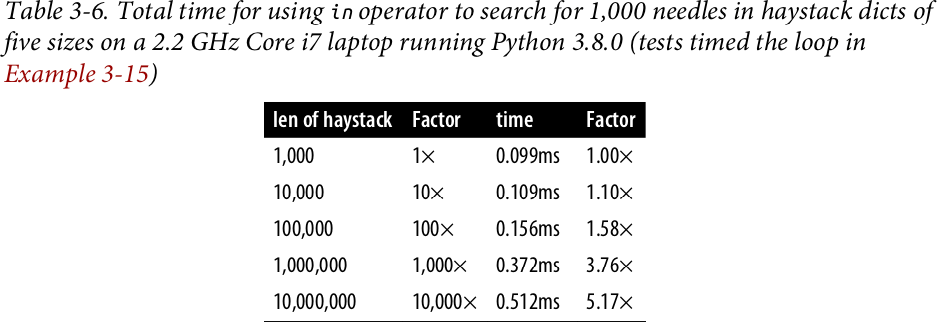

////
[[dict_perf_test_tbl]]
.Total time for using `in` operator to search for 1,000 needles in haystack dicts of five sizes on a 2.2 GHz Core i7 laptop running Python 3.8.0 (tests timed the loop in <<ex_for_perf>>)
[options="header"]
|==========================================
|len of haystack| Factor  |dict time|Factor
|         1,000 |      1× | 0.099ms | 1.00×
|        10,000 |     10× | 0.109ms | 1.10×
|       100,000 |    100× | 0.156ms | 1.58×
|     1,000,000 |  1,000× | 0.372ms | 3.76×
|    10,000,000 | 10,000× | 0.512ms | 5.17×
|==========================================
////

In concrete terms, to check for the presence of 1,000 floating-point keys in a dictionary with 1,000 items,
the processing time on my laptop was 99µs, and the same search in a `dict` with 10,000,000 items took 512µs.
In other words, the average time for each search in the haystack with 10 million items was 0.512µs--yes, that's about half microsecond per needle.
When the search space became 10,000 times larger, the search time increased a little over 5 times. Nice.

To compare with other collections, I repeated the benchmark with the same haystacks of increasing size, but storing the `haystack` as a `set` or as `list`. For the `set` tests, in addition to timing the `for` loop in <<ex_for_perf>>, I also timed the one-liner in <<ex_intersect_perf>>, which produces the same result: count the number of elements from `needles` that are also in `haystack`—if both are sets.

[[ex_intersect_perf]]
.Use set intersection to count the needles that occur in haystack
====
[source, python3]
----
found = len(needles & haystack)
----
====

<<table_dict_set_list_time>> shows the tests side by side. The best times are in the "set& time" column, which displays results for the set `&` operator using the code from <<ex_intersect_perf>>.
As expected, the worst times are in the "list time" column, because there is no hash table to support searches with the `in` operator on a `list`, so a full scan must be made if the needle is not present, resulting in times that grow linearly with the size of the haystack.

[[table_dict_set_list_time]]
.Table 3-7
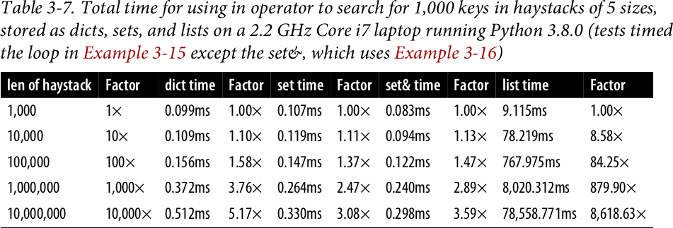

////
[[set_dict_search_time_tbl]]
.Total time for using in operator to search for 1,000 keys in haystacks of 5 sizes, stored as dicts, sets, and lists on a 2.2 GHz Core i7 laptop running Python 3.8.0 (tests timed the loop in <<ex_for_perf>> except the set&, which uses <<ex_intersect_perf>>)
[options="header"]
|=========================================================================================================
|len of haystack| Factor  |dict time|Factor |set time |Factor |set& time|Factor | list time    | Factor
|         1,000 |      1× | 0.099ms | 1.00× | 0.107ms | 1.00× | 0.083ms | 1.00× |      9.115ms |     1.00×
|        10,000 |     10× | 0.109ms | 1.10× | 0.119ms | 1.11× | 0.094ms | 1.13× |     78.219ms |     8.58×
|       100,000 |    100× | 0.156ms | 1.58× | 0.147ms | 1.37× | 0.122ms | 1.47× |    767.975ms |    84.25×
|     1,000,000 |  1,000× | 0.372ms | 3.76× | 0.264ms | 2.47× | 0.240ms | 2.89× |  8,020.312ms |   879.90×
|    10,000,000 | 10,000× | 0.512ms | 5.17× | 0.330ms | 3.08× | 0.298ms | 3.59× | 78,558.771ms | 8,618.63×
|=========================================================================================================
////

If your program does any kind of I/O, the lookup time for keys in dicts or sets is negligible, regardless of the `dict` or `set` size (as long as it fits in RAM). See the code used to generate <<set_dict_search_time_tbl>> and accompanying discussion in <<support_scripts>>, <<support_container_perftest>>.

Now that we have concrete evidence of the speed of dicts and sets, let's explore how that is achieved with the help of hash tables.

Before studying hash tables, we need to know more about hash codes, and how they relate to equality.

[[hashes_and_equality]]
== Hashes and equality

The `hash()` built-in function works directly with built-in types and falls back to calling `+__hash__+` for user-defined types. If two objects compare equal, their hash codes must also be equal, otherwise the hash table algorithm does not work. For example, because `1 == 1.0` is `True`, `hash(1) == hash(1.0)` must also be `True`, even though the internal representation of an `int` and a `float` are very different.footnote:[Since I just mentioned `int`, here is a CPython implementation detail: the hash code of an `int` that fits in a machine word is the value of the `int` itself, except the hash code of -1, which is -2.]

Also, to be effective as hash table indexes, hash codes should scatter around the index space as much as possible. This means that, ideally, objects that are similar but not equal should have hash codes that differ widely. <<ex_hashdiff_output>> is the output of a script to compare the bit patterns of hash codes. Note how the hashes of 1 and 1.0 are the same, but those of 1.0001, 1.0002, and 1.0003 are very different.

[[ex_hashdiff_output]]
.Comparing hash bit patterns of 1, 1.0001, 1.0002, and 1.0003 on a 32-bit build of Python (bits that are different in the hashes above and below are highlighted with ! and the right column shows the number of bits that differ)
====
[source]
----
32-bit Python build
1        00000000000000000000000000000001
                                          != 0
1.0      00000000000000000000000000000001
------------------------------------------------
1.0      00000000000000000000000000000001
           ! !!! ! !! ! !    ! ! !! !!!   != 16
1.0001   00101110101101010000101011011101
------------------------------------------------
1.0001   00101110101101010000101011011101
          !!!  !!!! !!!!!   !!!!! !!  !   != 20
1.0002   01011101011010100001010110111001
------------------------------------------------
1.0002   01011101011010100001010110111001
          ! !   ! !!! ! !  !! ! !  ! !!!! != 17
1.0003   00001100000111110010000010010110
------------------------------------------------
----
====

[NOTE]
====
Starting with Python 3.3, a random salt value is included when computing hash codes for `str`, `bytes`, and `datetime` objects,
as documented in https://bugs.python.org/issue13703[Issue 13703—Hash collision security issue].
The salt value is constant within a Python process but varies between interpreter runs.
With PEP-456, Python 3.4 adopted the SipHash cryptographic function to compute hash codes for `str` and `bytes` objects.
The random salt and SipHash are security measures to prevent DoS attacks.
Details are in a note in the documentation for pass:[<a href="http://bit.ly/1FESm0m">the <code>__hash__</code> special method</a>].
====

[[hash_collisions]]
=== Hash collisions

As mentioned, on 64-bit CPython a hash code is a 64-bit number, and that's 2^64^ possible values—which is more than 10^19^.
But most Python types can represent many more different values.
For example, a string made of 10 ASCII printable characters picked at random has 100^10^ possible values–more than 2^66^.
Therefore, the hash code of an object usually has less information than the actual object value.
This means that objects that are different may have the same hash code.

[TIP]
====
When correctly implemented, hashing guarantees that different hash codes always imply different objects, but the reverse is not true: different objects don't always have different hash codes. When different objects have the same hash code, that's a _hash collision_.
====

With this basic understanding of hash codes and object equality, we are ready to dive into how hash tables work, and how hash collisions are handled.

[[set_hash_tables_under_sec]]
== Set hash tables under the hood

Hash tables are a wonderful invention. Let's see how a hash table is used when adding elements to a set.

Let's say we have a set with abbreviated workdays, created like this:

[source, pycon]
----
>>> workdays = {'Mon', 'Tue', 'Wed', 'Thu', 'Fri'}
>>> workdays
{'Tue', 'Mon', 'Wed', 'Fri', 'Thu'}
----

The core data structure of a Python `set` is a hash table with at least 8 rows.
Traditionally, the rows in hash table are called __buckets__footnote:[The word "bucket" makes more sense to describe hash tables that hold more than one element per row.
Python stores only one element per row, but we will stick with the colorful traditional term.].

A hash table holding the elements of `workdays` looks like <<fig_hash_table_0>>.

[[fig_hash_table_0]]
.Hash table for the set `{'Mon', 'Tue', 'Wed', 'Thu', 'Fri'}`. Each bucket has two fields: the hash code and a pointer to the element value. Empty buckets have -1 in the hash code field. The ordering looks random.
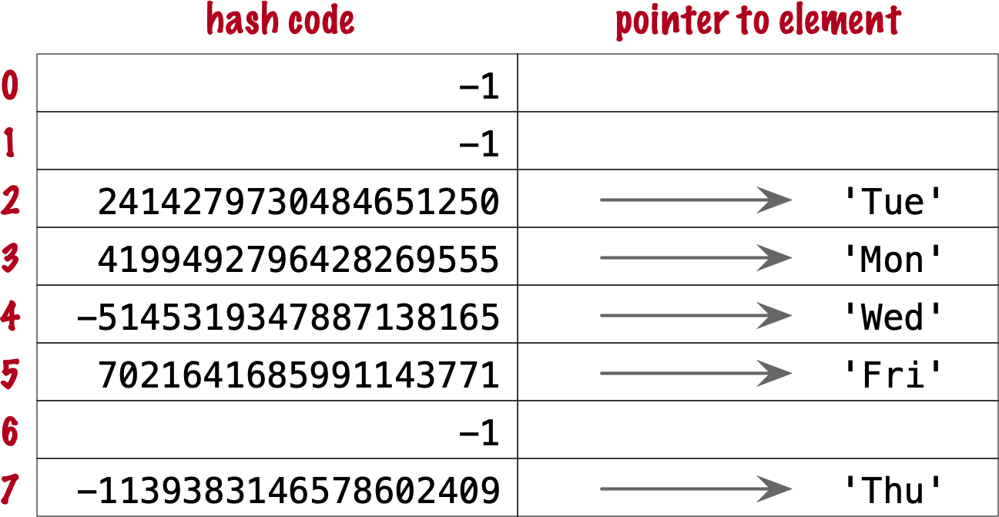

In CPython built for a 64-bit CPU, each bucket in a set has two fields:
a 64-bit hash code, and a 64-bit pointer to the element value—which is a Python object stored elsewhere in memory.
Because buckets have a fixed size, individual buckets are accessed by offset from the start of the hash table.
In other words, the indexes 0 to 7 in <<fig_hash_table_0>> are not stored, they are just offsets.

[[hash_table_algorithm_sec]]
=== The hash table algorithm

We will focus on the internals of `set` first, and later transfer the concepts to `dict`.

[NOTE]
====
This is a simplified view of how Python uses a hash table to implement a `set`. For all details, see commented source code for CPython's `set` and `frozenset` in https://github.com/python/cpython/blob/master/Include/setobject.h[Include/setobject.h] and https://github.com/python/cpython/blob/master/Objects/setobject.c[Objects/setobject.c].
====

Let's see how Python builds a set like `{'Mon', 'Tue', 'Wed', 'Thu', 'Fri'}`, step by step. The algorithm is illustrated by the flowchart in <<fig_flowchart_hash_add>>, and described next.

[[fig_flowchart_hash_add]]
.Flowchart for algorithm to add element to the hash table of a set.
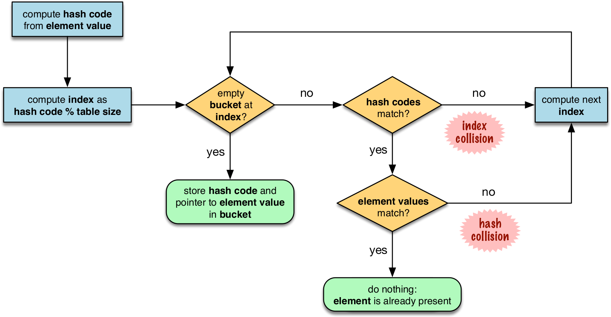

==== Step 0: initialize hash table

As mentioned earlier, the hash table for a `set` starts with 8 empty buckets. As elements are added, Python makes sure at least ⅓ of the buckets are empty—doubling the size of the hash table when more space is needed. The hash code field of each bucket is initialized with -1, which means "no hash code"footnote:[The `hash()` built-in never returns -1 for any Python object.
If `x.__hash__()` returns -1, `hash(x)` returns -2.].

==== Step 1: compute the hash code for the element

Given the literal `{'Mon', 'Tue', 'Wed', 'Thu', 'Fri'}`, Python gets the hash code for the first element, `'Mon'`.
For example, here is a realistic hash code for `'Mon'`—you'll probably get a different result because of the random salt Python uses to compute the hash code of strings:

[source, pycon]
----
>>> hash('Mon')
4199492796428269555
----

==== Step 2: probe hash table at index derived from hash code

Python takes the modulus of the hash code with the table size to find a hash table index. Here the table size is 8, and the modulus is 3:

[source, pycon]
----
>>> 4199492796428269555 % 8
3
----

Probing consists of computing the index from the hash, then looking at the corresponding bucket in the hash table.
In this case, Python looks at the bucket at offset 3 and finds -1 in the hash code field, marking an empty bucket.

==== Step 3: put the element in the empty bucket

Python stores the hash code of the new element, 4199492796428269555, in the hash code field at offset 3, and a pointer to the string object `'Mon'` in the element field. <<fig_hash_table_1>> shows the current state of the hash table.

[[fig_hash_table_1]]
.Hash table for the set `{'Mon'}`.
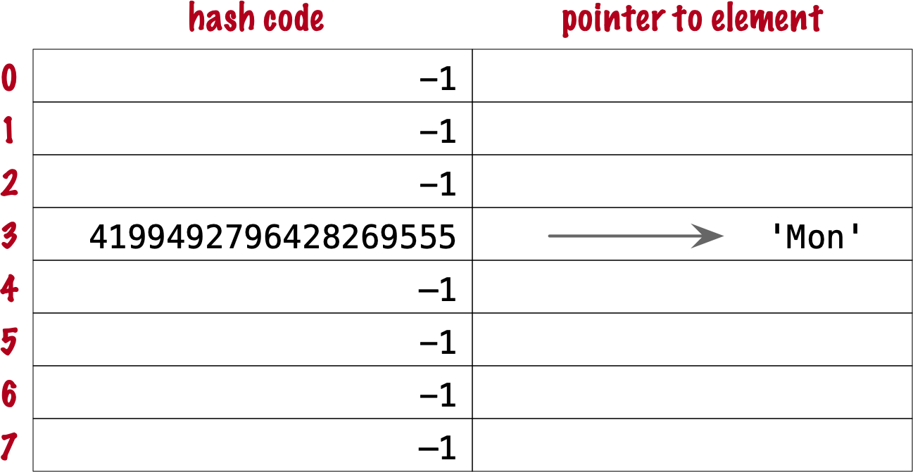

==== Steps for remaining items

For the second element, `'Tue'`, steps 1, 2, 3 above are repeated. The hash code for `'Tue'` is 2414279730484651250, and the resulting index is 2.

[source, pycon]
----
>>> hash('Tue')
2414279730484651250
>>> hash('Tue') % 8
2
----

The hash and pointer to element `'Tue'` are placed in bucket 2, which was also empty. Now we have <<fig_hash_table_2>>

[[fig_hash_table_2]]
.Hash table for the set `{'Mon', 'Tue'}`. Note that element ordering is not preserved in the hash table.
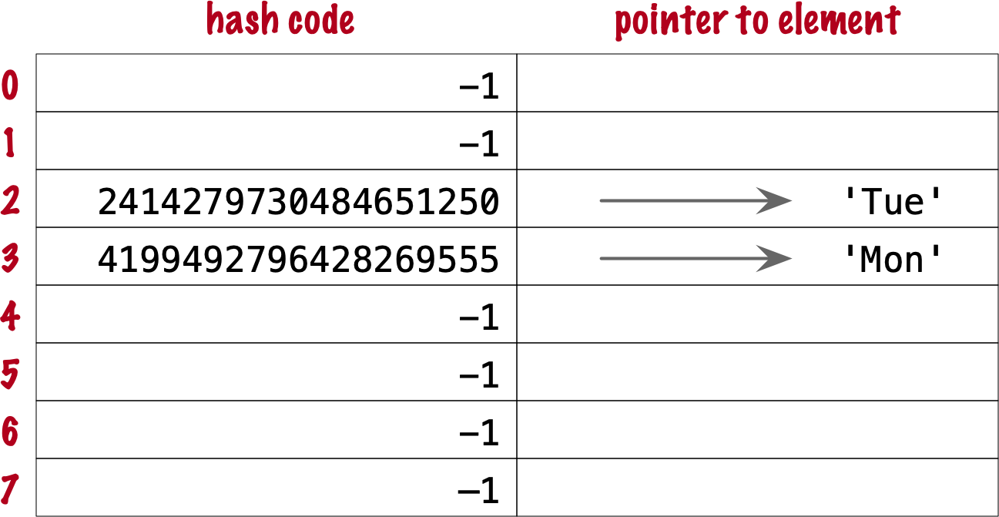

==== Steps for a collision

When adding `'Wed'` to the set, Python computes the hash -5145319347887138165 and index 3.
Python probes bucket 3 and sees that it is already taken. But the hash code stored there, 4199492796428269555 is different.
As discussed in <<hashes_and_equality>>, if two objects have different hashes, then their value is also different.
This is an index collision.
Python then probes the next bucket and finds it empty.
So `'Wed'` ends up at index 4, as shown in <<fig_hash_table_3>>.

[[fig_hash_table_3]]
.Hash table for the set `{'Mon', 'Tue', 'Wed'}`. After the collision, `'Wed'` is put at index 4.
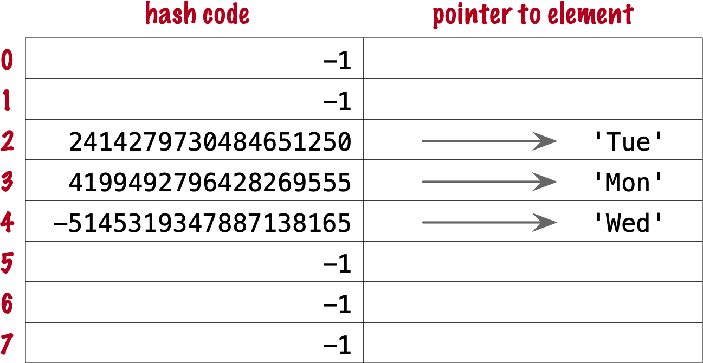

Adding the next element, `'Thu'`, is boring: there's no collision, and it lands in its natural bucket, at index 7.

Placing `'Fri'` is more interesting.
Its hash, 7021641685991143771 implies index 3, which is taken by `'Mon'`. Probing the next bucket—4—Python finds the hash for `'Wed'` stored there. The hash codes don't match, so this is another index collision. Python probes the next bucket. It's empty, so `'Fri'` ends up at index 5. The end state of the hash table is shown in <<fig_hash_table_4>>.

[NOTE]
====
Incrementing the index after a collision is called _linear probing_. This can lead to clusters of occupied buckets, which can degrade the hash table performance, so CPython counts the number of linear probes and after a certain threshold, applies a pseudo random number generator to obtain a different index from other bits of the hash code. This optimization is particularly important in large sets.
====

[[fig_hash_table_4]]
.Hash table for the set `{'Mon', 'Tue', 'Wed', 'Thu', 'Fri'}`. It is now 62.5% full—close to the ⅔ threshold.

When there is an element in the probed bucket and the hash codes match, Python also needs to compare the actual object values. That's because, as explained in <<hash_collisions>>, it's possible that two different objects have the same hash code—although that's rare for strings, thanks to the quality of the Siphash algorithmfootnote:[On 64-bit CPython, string hash collisions are so uncommon that I was unable to produce an example for this explanation. If you find one, let me know.]. This explains why hashable objects must implement both `+__hash__+` and `+__eq__+`.

If a new element were added to our example hash table, it would be more than ⅔ full, therefore increasing the chances of index collisions. To prevent that, Python would allocate a new hash table with 16 buckets, and reinsert all elements there.

All this may seem like a lot of work, but even with millions of items in a `set`, many insertions happen with no collisions, and the average number of collisions per insertion is between one and two. Under normal usage, even the unluckiest elements can be placed after a handful of collisions are resolved.

Now, given what we've seen so far, follow the flowchart in <<fig_flowchart_hash_add>> to answer the following puzzle without using the computer.

Given the following `set`, what happens when you add an integer `1` to it?

[source, pycon]
----
>>> s = {1.0, 2.0, 3.0}
>>> s.add(1)
----

How many elements are in `s` now? Does `1` replace the element `1.0`?
When you have your answer, use the Python console to verify it.

==== Searching elements in a hash table

Consider the `workdays` set with the hash table shown in <<fig_hash_table_4>>.
Is `'Sat'` in it? This is the simplest execution path for the expression `'Sat' in workdays`:

. Call `hash('Sat')` to get a hash code. Let's say it is 4910012646790914166
. Derive a hash table index from the hash code, using `hash_code % table_size`. In this case, the index is 6.
. Probe offset 6: it's empty. This means `'Sat'` is not in the set. Return `False`.

Now consider the simplest path for an element that is present in the set. To evaluate `'Thu' in workdays`:

. Call `hash('Tue')`. Pretend result is 6166047609348267525.
. Compute index: `6166047609348267525 % 8` is 5.
. Probe offset 5:
.. Compare hash codes. They are equal.
.. Compare the object values. They are equal. Return `True`.

Collisions are handled in the way described when adding an element.
In fact, the flowchart in <<fig_flowchart_hash_add>> applies to searches as well,
with the exception of the terminal nodes—the rectangles with rounded corners.
If an empty bucket is found, the element is not present, so Python returns `False`;
otherwise, when both the hash code and the values of the sought element match an element in the hash table, the return is `True`.

[[consequences_set_sec]]
=== Practical Consequences of How Sets Work

The `set` and `frozenset` types are both implemented with a hash table, which has these effects:

* Set elements must be hashable objects. They must implement proper `+__hash__+` and `+__eq__+` methods as described in <<what_is_hashable>>.
* Membership testing is very efficient. A set may have millions of elements, but the bucket for an element can be located directly by computing the hash code of the element and deriving an index offset, with the possible overhead of a small number of probes to find a matching element or an empty bucket.
* Sets have a significant memory overhead. The most compact internal data structure for a container would be an array of pointersfootnote:[That's how tuples are stored.]. Compared to that, a hash table adds a hash code per entry, and at least ⅓ of empty buckets to minimize collisions.
* Element ordering depends on insertion order, but not in a useful or reliable way. If two elements are involved in a collision, the bucket were each is stored depends on which element is added first.
* Adding elements to a set may change the order of other elements. That's because, as the hash table is filled, Python may need to recreate it to keep at least ⅓ of the buckets empty. When this happens, elements are reinserted and different collisions may occur.

[[hash_table_in_dict_sec]]
== Hash table usage in `dict`

[quote, Brandon Rhodes, in The Dictionary Even Mightier]
____
May your hashes be unique, +
Your keys rarely collide, +
And your dictionaries +
be forever ordered.footnote:[PyCon 2017 talk; video available at https://youtu.be/66P5FMkWoVU?t=56]
____

Since 2012, the implementation of the `dict` type had two major optimizations to reduce memory usage.
The first one was proposed as https://www.python.org/dev/peps/pep-0412/[PEP 412 -- Key-Sharing Dictionary] and implemented in Python 3.3footnote:[That was before I started writing the 1^st^ edition of _Fluent Python_, but I missed it.].
The second is called https://docs.python.org/3/whatsnew/3.6.html#new-dict-implementation["compact `dict`"], and landed in Python 3.6.
As a side effect, the compact `dict` space optimization preserves key insertion order.
In the next sections we'll discuss the compact `dict` and the new key-sharing scheme—in this order, for easier presentation.

[[how_compact_dict_ordering_sec]]
=== How compact `dict` saves space and keeps ordering

[NOTE]
====
This is a high level explanation of the Python `dict` implementation.
One difference is that the actual usable fraction of a `dict` hash table is ⅓, and not ⅔ as in sets.
The actual ⅓ fraction would require 16 buckets to hold the 4 items in my example `dict`,
and the diagrams in this section would become too tall, so I pretend the usable fraction is ⅔ in these explanations.
One comment in https://github.com/python/cpython/blob/master/Objects/dictobject.c[Objects/dictobject.c]
explains that any fraction between ⅓ and ⅔ "seem to work well in practice".
====

Consider a `dict` holding the abbreviated names for the weekdays from `'Mon'` through `'Thu'`, and the number of students enrolled in  swimming class on each day:

[source, pycon]
----
>>> swimmers = {'Mon': 14, 'Tue': 12, 'Wed': 14, 'Thu': 11}
----

Before the compact `dict` optimization, the hash table underlying the `swimmers` dictionary would look like <<fig_hash_table_dict_old>>.
As you can see, in a 64-bit Python, each bucket holds three 64-bit fields:
the hash code of the key, a pointer to the key object, and a pointer to the value object.
That's 24 bytes per bucket.

[[fig_hash_table_dict_old]]
.Old hash table format for a `dict` with 4 key-value pairs. Each bucket is a struct with the hash code of the key, a pointer to the key, and a pointer to the value.
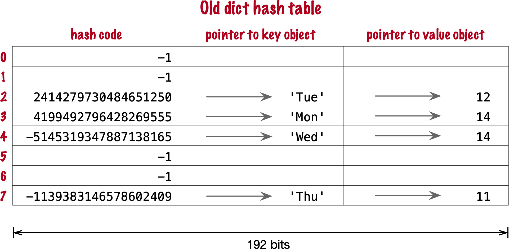

The first two fields play the same role as they do in the implementation of sets.
To find a key, Python computes the hash code of the key, derives an index from the key,
then probes the hash table to find a bucket with a matching hash code and a matching key object.
The third field provides the main feature of a `dict`: mapping a key to an arbitrary value.
The key must be a hashable object, and the hash table algorithm ensures it will be unique in the `dict`.
But the value may be any object—it doesn't need to be hashable or unique.

Raymond Hettinger observed that significant savings could be made if the hash code and pointers to key and value were held in an `entries` array with no empty rows,
and the actual hash table were a sparse array with much smaller buckets holding indexes into the `entries` arrayfootnote:[It's ironic that the buckets in the hash table here do not contain hash codes, but only indexes to the `entries` array where the hash codes are. But, conceptually, the `index` array is really the hash table in this implementation, even if there are no hashes in its buckets.].
In his original https://mail.python.org/pipermail/python-dev/2012-December/123028.html[message to _python-dev_],
Hettinger called the hash table `indices`. The width of the buckets in `indices` varies as the `dict` grows, starting at 8-bits per bucket—enough to index up to 128 entries, while reserving negative values for special purposes, such as -1 for empty and -2 for deleted.

As an example, the `swimmers` dictionary would then be stored as shown in <<fig_hash_table_dict_compact_4>>.

[[fig_hash_table_dict_compact_4]]
.Compact storage for a `dict` with 4 key-value pairs. Hash codes and pointers to keys and values are stored in insertion order in the `entries` array, and the entry offsets derived from the hash codes are held in the `indices` sparse array, where an index value of -1 signals an empty bucket.
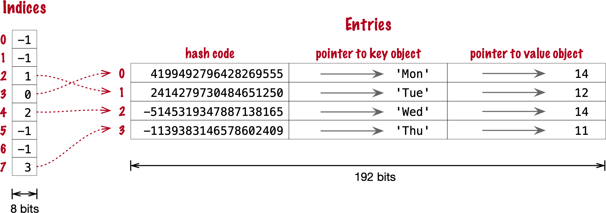

Assuming a 64-bit build of CPython, our 4-item `swimmers` dictionary would take 192 bytes of memory in the old scheme:
24 bytes per bucket, times 8 rows.
The equivalent compact `dict` uses 104 bytes in total: 96 bytes in `entries` (24 * 4),
plus 8 bytes for the buckets in `indices`—configured as an array of 8 bytes.

The next section describes how those two arrays are used.

==== Algorithm for adding items to compact `dict`.

===== Step 0: set up `indices`

The `indices` table is initially set up as an array of signed bytes, with 8 buckets, each initialized with -1 to signal "empty bucket".
Up to 5 of these buckets will eventually hold indices to rows in the `entries` array, leaving ⅓ of them with -1.
The other array, `entries`, will hold key/value data with the same three fields as in the old scheme—but in insertion order.

===== Step 1: compute hash code for the key

To add the key-value pair `('Mon', 14)` to the `swimmers` dictionary,
Python first calls `hash('Mon')` to compute the hash code of that key.

===== Step 2: probe `entries` via `indices`

Python computes `hash('Mon') % len(indices)`. In our example, this is 3.
Offset 3 in `indices` holds -1: it's an empty bucket.

===== Step 3: put key-value in `entries`, updating `indices`.

The `entries` array is empty, so the next available offset there is 0.
Python puts 0 at offset 3 in `indices` and stores
the hash code of the key, a pointer to the key object `'Mon'`, and a pointer to the `int` value `14`
at offset 0 in `entries`.
<<fig_hash_table_dict_compact_1>> shows the state of the arrays when the value of `swimmers` is `{'Mon': 14}`.

[[fig_hash_table_dict_compact_1]]
.Compact storage for the `{'Mon': 14}`: `indices[3]` holds the offset of the first entry: `entries[0]`.
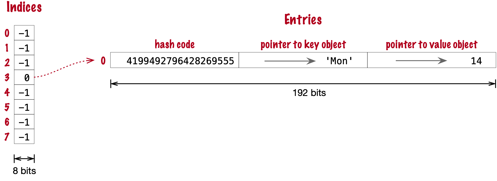

===== Steps for next item

To add `('Tue', 12)` to `swimmers`:

. Compute hash code of key `'Tue'`.
. Compute offset into `indices`, as `hash('Tue') % len(indices)`. This is 2. `indices[2]` has -1. No collision so far.
. Put the next available `entries` offset, 1, in `indices[2]`, then store entry at `entries[1]`.

Now the state is <<fig_hash_table_dict_compact_2>>. Note that `entries` holds the key-value pairs in insertion order.

[[fig_hash_table_dict_compact_2]]
.Compact storage for the `{'Mon': 14, 'Tue': 12}`.
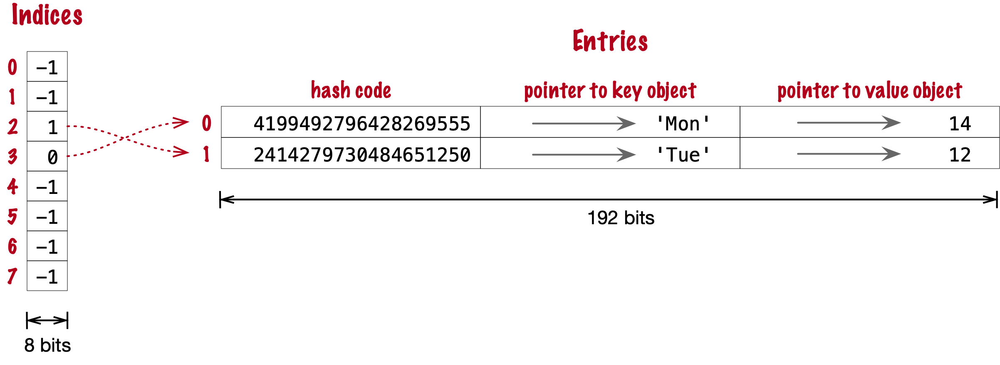

==== Steps for a collision

. Compute hash code of key `'Wed'`.
. Now, `hash('Wed') % len(indices)` is 3. `indices[3]` has 0, pointing to an existing entry.
Look at the hash code in `entries[0]`.
That's the hash code for `'Mon'`, which happens to be different than the hash code for `'Wed'`.
This mismatch signals a collision. Probes the next index: `indices[4]`.
That's -1, so it can be used.
. Make `indices[4] = 2`, because 2 is the next available offset at `entries`. Then fill `entries[2]` as usual.

After adding `('Wed', 14)`, we have <<fig_hash_table_dict_compact_3>>

[[fig_hash_table_dict_compact_3]]
.Compact storage for the `{'Mon': 14, 'Tue': 12, 'Wed': 14}`.
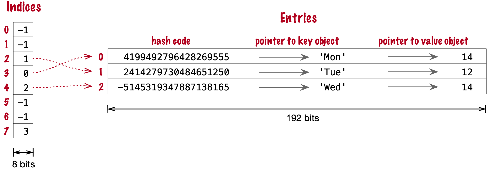

==== How a compact `dict` grows

Recall that the buckets in the `indices` array are 8 signed bytes initially, enough to hold offsets for up to 5 entries, leaving ⅓ of the buckets empty.
When the 6th item is added to the `dict`, `indices` is reallocated to 16 buckets—enough for 10 entry offsets.
The size of `indices` is doubled as needed, while still holding signed bytes, until the time comes to add the 129th item to the `dict`.
At this point, the `indices` array has 256 8-bit buckets. However, a signed byte is not enough to hold offsets after 128 entries,
so the `indices` array is rebuilt to hold 256 16-bit buckets to hold signed integers—wide enough to represent offsets to 32,768 rows in the `entries` table.
The next resizing happens at the 171st addition, when `indices` would become more than ⅔ full.
Then the number of buckets in `indices` is doubled to 512, but each bucket still 16-bits wide each.
In summary, the `indices` array grows by doubling the number of buckets,
and also—less often—by doubling the width of each bucket to accommodate a growing number of rows in `entries`.

This concludes our summary of the compact `dict` implementation.
I omitted many details, but now let's take a look at the other space-saving optimization for dictionaries: key-sharing.

[[key_sharing_dict_sec]]
=== Key-sharing dictionary

Instances of user-defined classes hold their attributes in a `+__dict__+`
attributefootnote:[Unless the class has a
https://docs.python.org/3/reference/datamodel.html#slots[`+__slots__+`] attribute.]
which is a regular dictionary.
An instance `+__dict__+` maps attribute names to attribute values.
Most of the time, all instances have the same attributes with different values.
When that happens, 2 of the 3 fields in the `entries` table for every instance have the exact same content:
the hash code of the attribute name, and a pointer to the attribute name.
Only the pointer to the attribute value is different.

In https://www.python.org/dev/peps/pep-0412/[PEP 412 — Key-Sharing Dictionary],
Mark Shannon proposed to split the storage of dictionaries used as instance `+__dict__+`,
so that each attribute hash code and pointer is stored only once, linked to the class,
and the attribute values are kept in parallel arrays of pointers attached to each instance.

Given a `Movie` class where all instances have the same attributes named
`'title'`, `'release'`, `'directors'`, and `'actors'`,
<<fig_hash_table_dict_split>> shows the arrangement of key-sharing in a split
dictionary—also implemented with the new compact layout.

[[fig_hash_table_dict_split]]
.Split storage for the `+__dict__+` of a class and three instances.
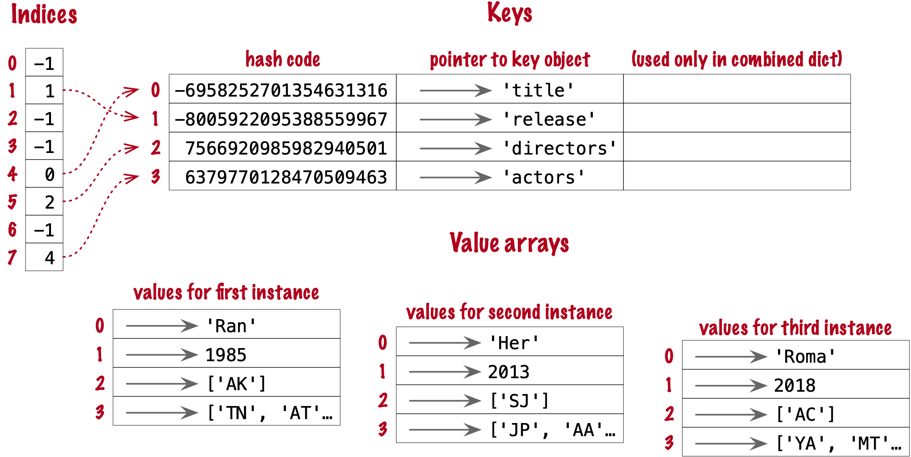

PEP 412 introduced the terms _combined-table_ to discuss the old layout and _split-table_ for the proposed optimization.

The combined-table layout is still the default when you create a `dict` using literal syntax or call `dict()`.
A split-table dictionary is created to fill the `+__dict__+` special attribute of an instance, when it is the first instance of a class.
The keys table (see <<fig_hash_table_dict_split>>) is then cached in the class object.
This leverages the fact that most Object Oriented Python code assigns all instance attributes in the `+__init__+` method.
That first instance (and all instances after it) will hold only its own value array.
If an instance gets a new attribute not found in the shared keys table, then this instance's `+__dict__+` is converted to combined-table form.
However, if this instance is the only one in its class, the `+__dict__+` is converted back to split-table,
since it is assumed that further instances will have the same set of attributes and key sharing will be useful.

The `PyDictObject` struct that represents a `dict` in the CPython source code is the same for both _combined-table_ and _split-table_ dictionaries.
When a `dict` converts from one layout to the other, the change happens in `PyDictObject` fields,
with the help of other internal data structures.

[[consequences_dict_sec]]
=== Practical Consequences of How dict Works

* Keys must be hashable objects. They must implement proper `+__hash__+` and `+__eq__+` methods as described in <<what_is_hashable>>.
* Key searches are nearly as fast as element searches in sets.
* Item ordering is preserved in the `entries` table—this was implemented in CPython 3.6, and became an official language feature in 3.7.
* To save memory, avoid creating instance attributes outside of the `+__init__+` method. If all instance attributes are created in `+__init__+`,
the `+__dict__+` of your instances will use the split-table layout, sharing the same indices and key entries array stored with the class.
