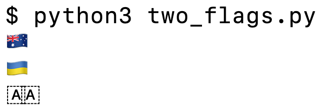
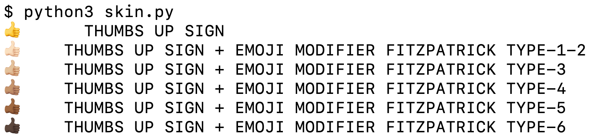
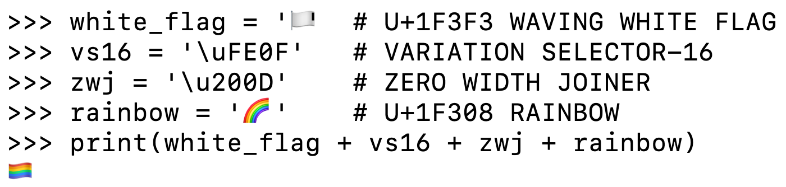
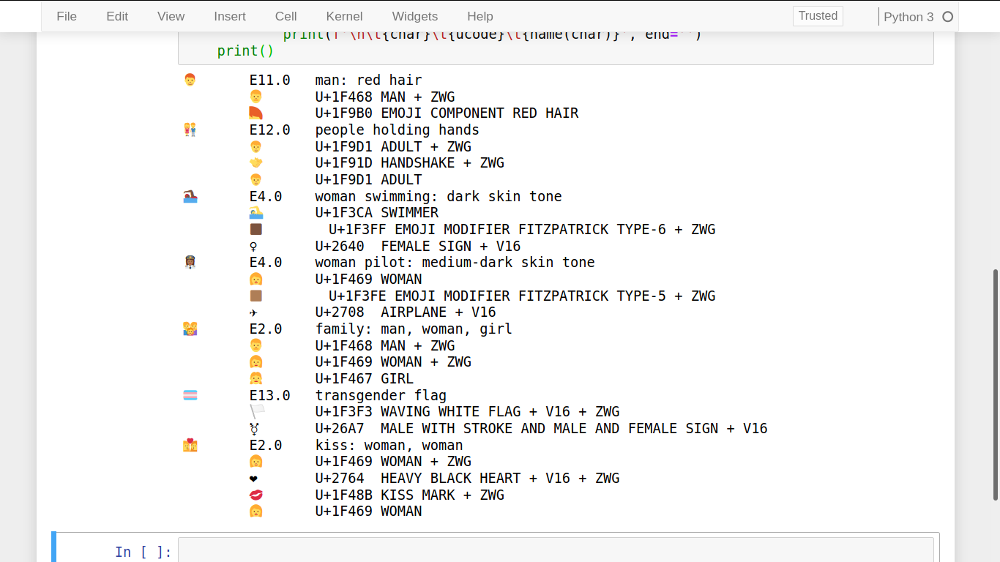
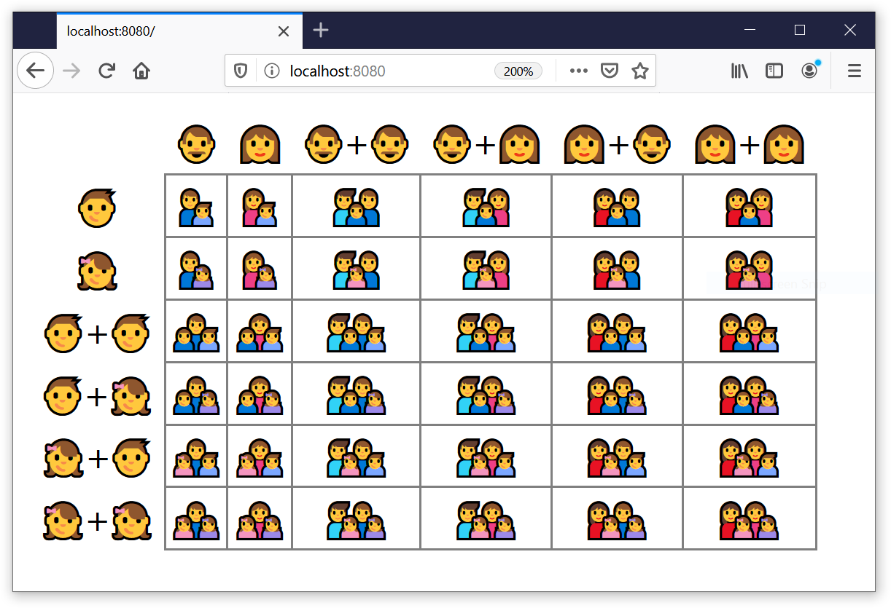

[[multi_char_emoji_sec]]
=== Multi-character emojis

As we saw in <<normalizing_unicode>>, it's always been possible to produce accented characters by combining Unicode letters and diacritics.
To accommodate the growing demand for emojis,
this idea has been extended to produce different pictographs by combining special markers and emoji characters.
Let's start with the simplest kind of combined emoji: flags of countries.

==== Country flags

Throughout history, countries split, join, mutate or simply adopt new flags.
The Unicode consortium found a way to avoid keeping up with those changes and outsource the problem to the systems that claim Unicode support:
its character database has no country flags.
Instead there is a set of 26 "regional indicator symbols letters", from A (U+1F1E6) to Z (U+1F1FF).
When you combine two of those indicator letters to form an ISO 3166-1 country code,
you get the corresponding country flag—if the UI supports it.
<<ex_two_flags>> shows how.

////
@@Leo

The wikipedia page calls them "regional indicator symbols".
I think you should drop the "letters" from "regional indicator symbols letters", or move it to the next part of the sentence:

"Instead there is a set of 26 "regional indicator symbols", corresponding to alphabet letters from A (U+1F1E6) to Z (U+1F1FF)."

Or "latin letters" instead of "alphabet letters".

////

[[ex_two_flags]]
.two_flags.py: combining regional indicators to produce flags
====
[source, python]
----
# REGIONAL INDICATOR SYMBOLS
RIS_A = '\U0001F1E6'  # LETTER A
RIS_U = '\U0001F1FA'  # LETTER U
print(RIS_A + RIS_U)  # AU: Australia
print(RIS_U + RIS_A)  # UA: Ukraine
print(RIS_A + RIS_A)  # AA: no such country
----
====

<<fig_two_flags>> shows the output of <<ex_two_flags>> on a MacOS 10.14 terminal.

[[fig_two_flags]]
.Screenshot of running two_flags.py from <<ex_two_flags>>. The AA combination is shown as two letters A inside dashed squares.

If your program outputs a combination of indicator letters that is not recognized by the app,
you get the indicators displayed as letters inside dashed squares—again, depending on the UI.
See the last line in <<fig_two_flags>>.

[NOTE]
====
Europe and the United Nations are not countries, but their flags are supported by the regional indicator pairs EU and UN, respectively.
England, Scotland, and Wales may or may not be separate countries by the time you read this,
but they also have flags supported by Unicode.
However, instead of regional indicator letters, those flags require a more complicated scheme.
Read https://blog.emojipedia.org/emoji-flags-explained/[Emoji Flags Explained] on https://emojipedia.org/[Emojipedia] to learn how that works.
====

////
@@Leo

"England, Scotland, and Wales may or may not be separate countries by the time you read this…"

🤣🤣🤣

////

Now let's see how emoji modifiers can be used to set the skin tone of emojis that show human faces, hands, noses etc.

==== Skin tones

Unicode provides a set of 5 emoji modifiers to set skin tone from pale to dark brown.
They are based on the https://en.wikipedia.org/wiki/Fitzpatrick_scale[Fitzpatrick scale]—developed
to study the effects of ultraviolet light on human skin.
<<ex_skin>> shows the use of those modifiers to set the skin tone of the thumbs up emoji.

[[ex_skin]]
.skin.py: the thumbs up emoji by itself, followed by all available skin tone modifiers.
====
[source, python3]
----
include::code/04-text-byte/skin.py[]
----
====
<1> EMOJI MODIFIER FITZPATRICK TYPE-1-2 is the first modifier.
<2> Build list with all five modifiers.
<3> Start list with the unmodified THUMBS UP SIGN.
<4> Extend list with the same emoji followed by each of the modifiers.
<5> Display emoji and tab.
<6> Display names of characters combined in the emoji, joined by `' + '`.

////
@@Jurgen

you write:
"THUMB = '\U0001F44d'  # THUMBS UP SIGN 👍"

While here in this text editor I see a thumbs up sign at the end of the line, in the PDF, both on Linux and Windows I only see an empty box - as you did not explain this line, I think this was not intentional.

@@Leo

Earlier in this chapter we used a figure (`unicodedata_name_fig`) because:

"emojis are not well supported by O'Reilly's digital publishing toolchain as I write this."

It looks like the same issue is happening here in Page 164, Ex 4-26 of `FluentPython2e-unreviewed-draft.pdf`.

////

The output of <<ex_skin>> looks like <<skin_demo_fig>> on MacOS.
As you can see, the unmodified emoji has a cartoonish yellow color,
while the others have more realistic skin tones.

[[skin_demo_fig]]
.Screenshot of <<ex_skin>> in the MacOS 10.14 terminal.

Let's now move to more complex emoji combinations using special markers.

==== Rainbow flag and other ZWJ sequences

Besides the special purpose indicators and modifiers we've seen,
Unicode provides a marker that is used as glue between emojis and other characters,
to produce new combinations: U+200D, ZERO WIDTH JOINER—a.k.a. ZWJ in many Unicode documents.

For example, the rainbow flag is built by joining the emojis WAVING WHITE FLAG and RAINBOW,
as <<fig_rainbow_flag>> shows.

////
@@Leo

I added what I thought was a missing "the" and a comma in the sentence above,
between "For example" and "rainbow flag".

////

[[fig_rainbow_flag]]
.Making the rainbow flag in the Python console.

Unicode 13 supports more than 1100 ZWJ emoji sequences as
RGI—"recommended for general interchange [...] intended to be widely supported across multiple platforms".footnote:[Definition quoted from http://www.unicode.org/reports/tr51/[Technical Standard #51 Unicode Emoji.]]
You can find the full list of RGI ZWJ emoji sequences in https://unicode.org/Public/emoji/13.0/emoji-zwj-sequences.txt[emoji-zwj-sequences.txt] and a small sample in <<fig_zwj_sample>>.

[[fig_zwj_sample]]
.Sample ZWJ sequences generated by <<ex_zwj_sample>>, running in a Jupyter Notebook, viewed on Firefox 72 on Ubuntu 19.10. This browser/OS combo can display all the emojis from this sample, including the newest: "people holding hands" and "transgender flag", added in Emoji 12.0 and 13.0.

<<ex_zwj_sample>> is the source code that produced <<fig_zwj_sample>>. You can run it from your shell, but for better results I recommend pasting it inside a Jupyter Notebook to run it in a browser. Browsers often lead the way in Unicode support, and provide prettier emoji pictographs.

[[ex_zwj_sample]]
.zwj_sample.py: produce listing with a few ZWJ characters.
====
[source, python3]
----
include::code/04-text-byte/zwj_sample.py[]
----
====

////
@@Miro

    while chars:
        char = chars.pop(0)

When I see this, I expect that there's another pop elsewhere in the block
or that the pop should be in a condition and I re-read it several times to
understand the intent. That's not the case, so it should be a single line:

    for char in chars:

////

One trend in modern Unicode is the addition of gender-neutral emojis such as SWIMMER (U+1F3CA) or ADULT (U+1F9D1),
which can then be shown as they are, or with different gender in ZWJ sequences with the female sign ♀ (U+2640) or the male sign ♂ (U+2642).
The Unicode Consortium is also moving towards more diversity in the supported family emojis.
// @@miro update date
<<fig_emoji_families>> is a matrix of family emojis showing current support for families with different combinations of parents and children—as of January 2020.

[[fig_emoji_families]]
.The table shows adult singles and couples at the top, and boys and girls on the left-hand side. Cells have the combined emoji of a family with the parent(s) from the top and kid(s) from the left. If a combination is not supported by the browser, more than one emoji will appear inside a cell. Firefox 72 on Windows 10 is able to show all combinations.

The code I wrote to build <<fig_emoji_families>> is mostly concerned with HTML formatting, but is listed in <<ex_emoji_families>> for completeness.

////
@@Jurgen

you write "but is listed in ??? for completeness."

Again, our friends the three question marks.

@@Leo

Jurgen is talking about `ex_emoji_families`,
which is mentioned above but is not defined anywhere in this repo so far.

By the way, there is an "Example 4-28" on a line by itself in the PDF at this point, with no actual source code attached to it.

And the [INFO] paragraph below renders as a normal paragraph, not as a callout.
So I went ahead and turned into a NOTE, though I wasn't sure if you wanted a TIP instead.

////

[NOTE]
====
Browsers follow the evolution of Unicode Emoji closely, and here no OS has a clear advantage.
While preparing this chapter, I captured <<fig_zwj_sample>> on Ubuntu 19.10 and <<fig_emoji_families>> on Windows 10,
using Firefox 72 on both,
because those were the OS/browser combinations with the most complete support for the emojis in those examples.
====

