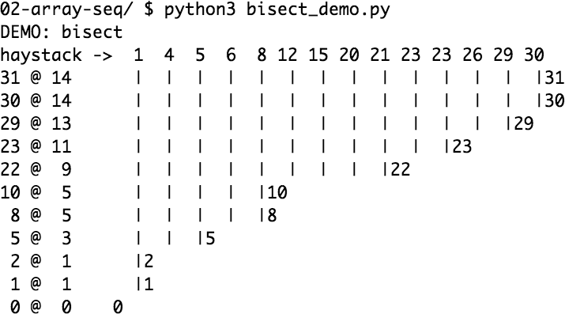
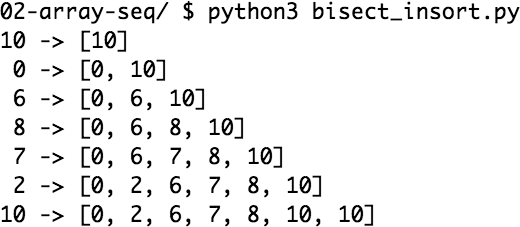

The `bisect` module offers two main functions that use the binary search algorithm to quickly find and insert items in any sorted sequence.

* <<searching_sec>>
* <<insort_sec>>

[[searching_sec]]
== Searching with `bisect`

`bisect(haystack, needle)` does a binary search for `needle` in ++haystack++—which must be a sorted sequence—to locate the position where `needle` can be inserted while maintaining `haystack` in ascending order.
In other words, all items appearing up to that position are less than or equal to `needle`.
You could use the result of `bisect(haystack, needle)` as the `index` argument to `haystack.insert(index, needle)`&#x2014;however, using `insort` does both steps, and is faster.

[TIP]
====
Raymond Hettinger wrote a http://bit.ly/1Vm6WEa[`SortedCollection` recipe] that leverages the `bisect` module and is easier to use than these standalone functions.
====

<<ex_bisect_demo>> uses a carefully chosen set of "needles" to demonstrate the insert positions returned by `bisect`.
Its output is in <<ex_bisect_demo_output>>.

[[ex_bisect_demo]]
.bisect finds insertion points for items in a sorted sequence
====
[source, py]
----
include::./content/extra/ordered-sequences-with-bisect/bisect_demo.py[tags=BISECT_DEMO]
----
====
<1> Use the chosen `bisect` function to get the insertion point.
<2> Build a pattern of vertical bars proportional to the `offset`.
<3> Print formatted row showing needle and insertion point.
<4> Choose the `bisect` function to use according to the last command-line argument.
<5> Print header with name of function selected.

////
@@Leo

The variable `ROW_FMT` in the code above demonstrates a good use of `str.format()` instead of f-strings:

It's defined once, then `.format()` is called multiple times in a `for` loop.

////

[[ex_bisect_demo_output]]
.Output of <<ex_bisect_demo>> with bisect in use&#x2014;each row starts with the notation needle @ position and the needle value appears again below its insertion point in the haystack

The behavior of `bisect` can be fine-tuned in two ways.

First, a pair of optional arguments, `lo` and `hi`, allow narrowing the region in the sequence to be searched when inserting. `lo` defaults to 0 and `hi` to the `len()` of the sequence.

Second, `bisect` is actually an alias for `bisect_right`, and there is a sister function called `bisect_left`.
Their difference is apparent only when the needle compares equal to an item in the list: `bisect_right` returns an insertion point after the existing item, and `bisect_left` returns the position of the existing item, so insertion would occur before it.
With simple types like `int`, inserting before or after makes no difference,
but if the sequence contains objects that are distinct yet compare equal, then it may be relevant.
For example, `1` and `1.0` are distinct, but `1 == 1.0` is `True`. <<ex_bisect_demo_left_output>> shows the result of using `bisect_left`.

[[ex_bisect_demo_left_output]]
.Output of <<ex_bisect_demo>> with bisect_left in use (compare with <<ex_bisect_demo_output>> and note the insertion points for the values 1, 8, 23, 29, and 30 to the left of the same numbers in the haystack).
image::images/flup_0205.png[alt="Output of `bisect_demo.py` running `bisect_left`."]

An interesting application of `bisect` is to perform table lookups by numeric values--for example,
to convert test scores to letter grades, as in <<ex_bisect_lookup>>.

[[ex_bisect_lookup]]
.Given a test score, grade returns the corresponding letter grade
====
[source, pycon]
----
>>> breakpoints = [60, 70, 80, 90]
>>> grades='FDCBA'
>>> def grade(score):
...     i = bisect.bisect(breakpoints, score)
...     return grades[i]
...
>>> [grade(score) for score in [55, 60, 65, 70, 75, 80, 85, 90, 95]]
['F', 'D', 'D', 'C', 'C', 'B', 'B', 'A', 'A']
----
====

The code in <<ex_bisect_lookup>> is from the https://docs.python.org/3/library/bisect.html[`bisect` module documentation], which also lists functions to use `bisect` as a faster replacement for the `index` method when searching through long ordered sequences of numbers.

When used for table lookups, `bisect_left` produces very different resultsfootnote:[Thanks to reader Gregory Sherman for pointing this out.].
Note the letter grade results in <<ex_bisectleft_lookup>>.

[[ex_bisectleft_lookup]]
.`bisect_left` maps a score of 60 to grade 'F', not 'D' as in <<ex_bisect_lookup>>.
====
[source, pycon]
----
>>> breakpoints = [60, 70, 80, 90]
>>> grades='FDCBA'
>>> def grade(score):
...     i = bisect.bisect_left(breakpoints, score)
...     return grades[i]
...
>>> [grade(score) for score in [55, 60, 65, 70, 75, 80, 85, 90, 95]]
['F', 'F', 'D', 'D', 'C', 'C', 'B', 'B', 'A']
----
====

These functions are not only used for searching, but also for inserting items in sorted sequences,
as the following section shows.

[[insort_sec]]
== Inserting with `insort`

Sorting is expensive, so once you have a sorted sequence, it's good to keep it that way.
That is why `bisect.insort` was created.

`insort(seq, item)` inserts `item` into `seq` so as to keep `seq` in ascending order.
See <<ex_insort>> and its output in <<ex_insort_output>>.

[[ex_insort]]
.Insort keeps a sorted sequence always sorted
====
[source, python3]
----
include::./content/extra/ordered-sequences-with-bisect/bisect_insort.py[]
----
====

[[ex_insort_output]]
.Output of <<ex_insort>>

Like `bisect`, `insort` takes optional `lo`, `hi` arguments to limit the search to a sub-sequence.
There is also an `insort_left` variation that uses `bisect_left` to find insertion points.

